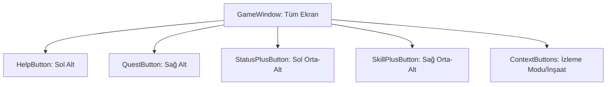

# 🎓 Metin2 Skills: `gamewindow.py` (Genel Oyun Ekranı Butonları)

`gamewindow.py`, oyun ekranında (HUD üzerinde değil, doğrudan dünya üzerinde) yüzen ve oyuncuya çeşitli bildirimler/kısayollar sunan "büyük artı" butonlarını yöneten dosyadır.

---

## 🔍 Neleri Yönetir?

### 1. Statü ve Beceri Bildirimleri
Oyuncu seviye atladığında veya statü/beceri puanı kazandığında ekranın sol veya sağ alt köşesinde beliren butonlardır:
- **`StatusPlusButton`**: "Statü Artır" uyarısı verir.
- **`SkillPlusButton`**: "Beceri Puanı Dağıt" uyarısı verir.

### 2. Görev ve Yardım Butonları
- **`QuestButton`**: Yeni bir görev geldiğinde yanıp sönen butondur.
- **`HelpButton`**: Oyun içi yardım rehberini açar.

### 3. Özel Durum Butonları
- **`ExitObserver`**: Birini izlerken (Spectator mode) izleme modundan çıkmayı sağlar.
- **`BuildGuildBuilding`**: Lonca arazisindeyken bina inşa menüsünü tetikler.

---

## 🛠️ Modifikasyon ve Kritik Uyarılar

### ✅ Buton Görsellerini Özelleştirme:
Bu butonlar standart olarak `btn_bigplus_up.sub` görselini kullanır. Eğer daha modern veya farklı bir bildirim simgesi (Örn: Ünlem işareti) istersen, buradaki görsel yollarını güncelleyebilirsin.

### ⚠️ `not_pick` Stili:
Bu pencere `style : ("not_pick",)` parametresine sahiptir. Bu, farenin bu pencerenin boş alanlarına tıkladığında oyun dünyasına (Hareket etme, saldırma) engel olmamasını sağlar. Sadece butonların üzerine tıklandığında etkileşim gerçekleşir.

---

## 📉 gamewindow.py Tasarım Hiyerarşisi

---

**Veri Akışı:** `Server (Notification)` -> `root/game.py` -> `gamewindow.py` -> Ekran.
