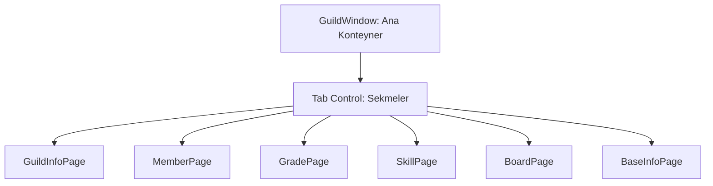

# 🎓 Metin2 Skills: `guildwindow.py` (Lonca Penceresi)

`guildwindow.py`, oyuncuların lonca bilgilerini, üyelerini, rütbelerini ve becerilerini yönettiği devasa bir kontrol panelidir. Bu pencere, her biri ayrı bir `.py` dosyasında tanımlanan çok sayıda "Sayfa" (Page) yapısından oluşur.

---

## 🔍 Neleri Yönetir?

### 1. Sayfa Tabanlı Mimari
Lonca penceresi tıklandığında aşağıdaki alt sayfalar dinamik olarak yüklenir:
- **`guildwindow_guildinfopage.py`**: Lonca ismi, seviyesi, EXP miktarı ve lonca duyurusunun göründüğü ana sayfadır.
- **`guildwindow_memberpage.py`**: Lonca üyelerinin listesi, çevrimiçi durumları, karakter sınıfları ve seviyelerinin listelendiği alandır.
- **`guildwindow_gradepage.py`**: Lonca rütbelerinin (Lider, Üye vb.) yetkilerinin (Davet, Atma, Yazma) ayarlandığı sayfadır.
- **`guildwindow_guildskillpage.py`**: Lonca savaşlarında kullanılan özel becerilerin ve aktif olan bonusların listesidir.
- **`guildwindow_boardpage.py`**: Lonca içindeki mesajlaşma ve duyuru tahtasıdır.
- **`guildwindow_baseinfopage.py`**: Lonca arazisi ve binaları ile ilgili temel bilgileri barındırır.

### 2. Sekme Yönetimi
Pencerenin üstünde yer alan sekmeler, bu alt sayfalar arasında geçişi sağlar.

---

## 🛠️ Modifikasyon ve Kritik Uyarılar

### ✅ Üye Listesi Sütunları:
Eğer üye listesine yeni bir bilgi (Örn: "Son Giriş Tarihi") eklemek istersen, `memberpage.py` içindeki sütun başlıklarını ve veri slotlarını genişletmelisin.

### ⚠️ Bölgesel Farklılıklar:
Klasörde `guildinfopage_jp.py` veya `_eu.py` gibi dosyalar görebilirsin. Metin2 motoru, oyunun çalıştığı bölgeye göre farklı mizanpajlar yükleyebilir. Genellikle Türkiye sunucularında standart olan dosya kullanılır.

---

## 📉 guildwindow.py Tasarım Hiyerarşisi

---

**Veri Akışı:** `Server (Guild Data)` -> `root/uiguild.py` -> `guildwindow.py` -> Ekran.
