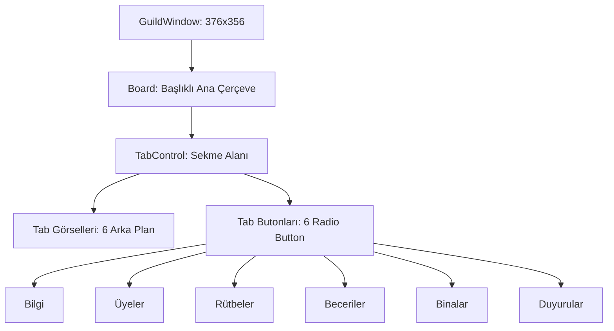

# 🎓 Metin2 Skills: `guildwindow.py` (Lonca Penceresi Tasarımı)

`guildwindow.py`, lonca yönetim panelinin ana çerçevesini ve 6 farklı sekmeye (Bilgi, Üyeler, Rütbeler, Beceriler, Binalar, Duyurular) geçiş yapan butonların tasarımını yöneten dosyadır.

---

## 🔍 Neleri Yönetir?

### 1. Sekme Görselleri (`Tab_01` – `Tab_06`)
Hangi sekme seçiliyse, o sekmenin vurgulandığı (aktif) arka plan görselini belirler. Her sekme için farklı bir `.sub` dosyası kullanılır.

### 2. Sekme Butonları (`Tab_Button_01` – `Tab_Button_06`)
Her sekmeye geçişi tetikleyen görünmez `radio_button` bileşenlerini yönetir. Bunlar `.sub` görselleri üzerine "klikleme alanı" (hitbox) olarak oturur.

### 3. Locale Bağımlılığı (`LOCALE_PATH`)
Sekme görselleri farklı diller için farklı klasörlerden çekilir. Türkçe, Almanca veya Korece sunucularda sekmelerdeki yazılar değişir.

---

## 🛠️ Modifikasyon ve Kritik Uyarılar

### ✅ Yeni Sekme Ekleme:
Loncaya yeni bir sayfa (Örn: "Lonca Deposu") eklemek istersen, `Tab_07` + `Tab_Button_07` tanımlamalı ve `uiGuild.py` tarafında bu butona bir fonksiyon bağlamalısın.

### ✅ Buton Genişlikleri:
6 butonun toplam genişliği (`53+67+60+60+60+55 ≈ 355`) pencerenin genişliğine (376) uyacak şekilde hesaplanmıştır. Yeni sekme eklerken mevcut genişlikleri daraltman gerekebilir.

### ⚠️ Görsel-Buton Eşleşmesi:
`Tab_Button_01`'in koordinatları `Tab_01` görselindeki ilk sekme yazısıyla tam örtüşmelidir; aksi halde oyuncu doğru yere tıkladığını düşünürken yanlış sekmeyi açabilir.

---

## 📉 guildwindow.py Sekme Yapısı

---

**Sonuç:** `guildwindow.py`, loncanın "Ana Menüsüdür". 6 sekmeli yapısıyla oyundaki en kapsamlı yönetim panellerinden biridir.
