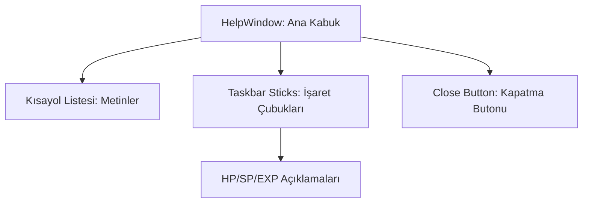

# 🎓 Metin2 Skills: `helpwindow.py` (Yardım ve Kılavuz Ekranı)

`helpwindow.py`, yeni başlayan oyuncular için oyun kontrollerini ve arayüz elemanlarını (HP, SP, Exp barları vb.) açıklayan görsel kılavuzun tasarımıdır. Oyunun başında otomatik olarak veya "H" tuşuyla tetiklenebilir.

---

## 🔍 Neleri Yönetir?

### 1. Klavye Kısayol Açıklamaları (`help_01` - `help_19`)
Ekranın ortasında liste şeklinde duran ve hangi tuşun ne işe yaradığını (W-A-S-D: Hareket, I: Envanter vb.) belirleyen metin bloklarıdır.
- **`text`**: Metinler `uiScriptLocale` üzerinden çekilir, böylece farklı dillerde otomatik güncellenir.
- **`outline`**: Metinlerin daha okunaklı olması için etrafındaki siyah çerçeveyi aktif eder.

### 2. Taskbar Yardım Çubukları (`taskbar_help_stick`)
Ekranın altındaki HP, SP ve EXP barlarına işaret eden "ince çubuklar" (`HELP_STICK_IMAGE_FILE_NAME`) ve onların ucundaki açıklama metinleridir.
- **`rect`**: Çubukların eğimini ve yönünü belirleyen koordinat verileridir.

### 3. Dinamik Konumlandırma
`SCREEN_WIDTH` ve `SCREEN_HEIGHT` kullanılarak yapılan hesaplamalar (Örn: `SCREEN_WIDTH * 150 / 800`), kılavuzun her zaman ekran çözünürlüğüne uygun şekilde hizalanmasını sağlar.

---

## 🛠️ Modifikasyon ve Kritik Uyarılar

### ✅ Yeni Kısayol Ekleme:
Eğer sunucuna özel yeni bir sistem eklediysen (Örn: "F5: Efsun Botu"), `help_19`'un altına `help_20` şeklinde yeni bir `text` bloğu ekleyerek bunu kılavuza dahil edebilirsin.

### ⚠️ Hizalama Sorunları:
`vertical_align` ve `horizontal_align` değerlerine dikkat edilmelidir. Aksi takdirde yardım çubukları HP barı yerine ekranın ortasını gösterebilir.

---

## 📉 helpwindow.py Tasarım Hiyerarşisi

---

**Veri Akışı:** `uiScriptLocale` (Diller) -> `uihelp.py` (Logic) -> `helpwindow.py` (Görsel İşaretçiler) -> Ekran.
