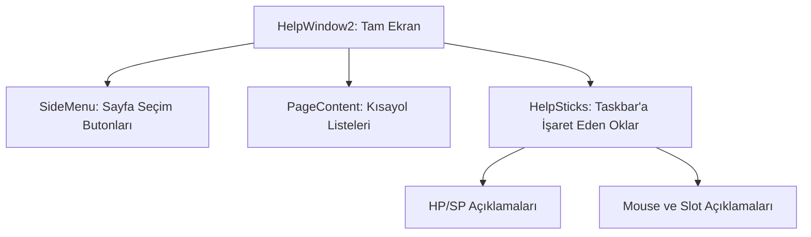

# 🎓 Metin2 Skills: `helpwindow2.py` (Gelişmiş Yardım Rehberi)

`helpwindow2.py`, oyuncuya oyunun kontrollerini, arayüz bileşenlerini ve kısayol tuşlarını öğreten, görsel oklarla (`help_stick`) desteklenmiş gelişmiş bir rehber penceresidir.

---

## 🔍 Neleri Yönetir?

### 1. Sayfalı Yardım İçeriği (`page_1`, `page_2`)
Yardım konularını kategorize eder. `page_1` genellikle temel kısayolları (C, I, M, ESC vb.) listeleyen metin alanlarını barındırır.

### 2. Görsel İşaretçiler (`TaskBar Help Sticks`)
Bu dosyanın en benzersiz özelliğidir. Ekranın altındaki Taskbar bileşenlerine (HP, SP, EXP barı, Kısayol slotları) işaret eden çizgiler (`HELP_STICK_IMAGE_FILE_NAME`) ve bu çizgilerin ucunda açıklamalar barındırır:
- **`taskbar_help_02`**: HP barını açıklar.
- **`taskbar_help_07`**: Kısayol slotlarını (Quickslot) açıklar.

### 3. Kontrol Butonları
Sayfalar arası geçişi sağlayan `page_1_button`, `page_2_button` ve rehberi kapatan `close_button` bileşenlerini barındırır.

---

## 🛠️ Modifikasyon ve Kritik Uyarılar

### ✅ Yeni Yardım Konusu Ekleme:
Eğer sunucuna özel bir sistem (Örn: "Pazar Arama") eklediysen, bu dosyaya yeni bir `text` bloğu ekleyerek kısayolunu oyunculara burada gösterebilirsin.

### ⚠️ Koordinat Senkronizasyonu:
`taskbar_help_stick` bileşenlerinin koordinatları (`SCREEN_HEIGHT - 120` gibi) Taskbar'ın standart konumuna göre ayarlanmıştır. Eğer Taskbar tasarımını veya yüksekliğini değiştirdiysen, bu okların uçlarının doğru yerleri göstermesi için koordinatları tek tek güncellemelisin.

---

## 📉 helpwindow2.py Tasarım Hiyerarşisi

---

**Veri Akışı:** `Oyuncu Yardımı (H)` -> `root/uihelp.py` -> `helpwindow2.py`.
