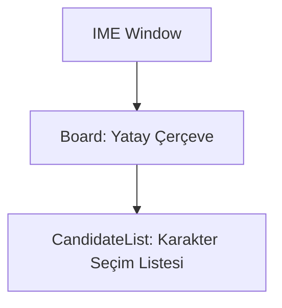

# 🎓 Metin2 Skills: `imekor.py` (Giriş Yöntemi Düzenleyicisi - IME)

`imekor.py`, özellikle Korece, Çince veya Japonca gibi dillerde yazı yazarken karakter seçimi yapmayı sağlayan "Aday Listesi" (Candidate List) penceresini yönetir.

---

## 🔍 Neleri Yönetir?

### 1. Aday Listesi Çerçevesi (`Base_Board_01`)
Yazılan karakterin olası karşılıklarının listelendiği yatay paneli (`HorizontalCandidateBoard.sub`) temsil eder.

### 2. Aday Öğeleri (`CandidateList`)
- **`type : candidate_list`**: Metin2 motoruna özel bir kontrol tipidir. Klavyeden girilen fonetik seslerin karşılığı olan karakterleri yan yana dizer.
- **`item_step`**: Karakterler arasındaki boşluğu belirler.

---

## 🛠️ Modifikasyon ve Kritik Uyarılar

### ✅ Dil Desteği:
Eğer sadece Türkçe veya İngilizce bir sunucu işletiyorsan bu dosya genellikle işlevsizdir. Ancak çok dilli (Global) bir sunucuda Asyalı oyuncuların chat yapabilmesi için bu dosyanın ve ilgili `.sub` görsellerinin doğru çalışması gerekir.

### ⚠️ Konumlandırma:
Bu pencere dinamik olarak farenin veya imlecin bulunduğu yere yakın bir konumda açılacak şekilde kodlanmıştır. Sabit koordinatları (`100, 300`) sadece varsayılan başlangıç noktasıdır.

---

## 📉 imekor.py Tasarım Hiyerarşisi

---

**Veri Akışı:** `Windows IME API` -> `İstemci Motoru` -> `imekor.py` -> Ekran.
