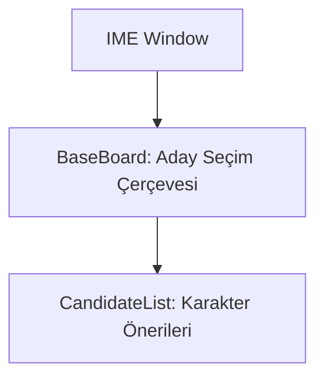

# 🎓 Metin2 Skills: `imekor.py` (Korece Giriş Metodu Düzenleyicisi)

`imekor.py`, (Input Method Editor - Korean), orijinal Metin2'nin geliştirildiği Korece dili için klavyeden karmaşık harfleri yazmayı sağlayan giriş arayüzünün tasarım dosyasıdır.

---

## 🔍 Neleri Yönetir?

### 1. Aday Listesi (`CandidateList`)
Korece gibi dillerde, klavyeden basılan tuşların oluşturabileceği birden fazla "Aday Harf" (Candidate) olabilir. Oyuncu bu listeden ok tuşlarıyla seçim yapar.

### 2. Çok Dar Kullanım
Bu arayüz (`HorizontalCandidateBoard.sub`), sadece Korece veya Çince karakterler kullanan client'larda aktiftir.

---

## 🛠️ Modifikasyon ve Kritik Uyarılar

### ⚠️ Gereksiz Dosya:
Türkiye veya Avrupa lokasyonlu bir sunucu kuruyorsan, bu dosyaya veya tasarıma hiçbir zaman ihtiyaç duymazsın. Hatta modifikasyon sırasında silinmesi, istemciyi temizlemek adına iyi bir adımdır (Ancak C++ tarafından çağrısının da kapatılması gerekir).

## 📉 imekor.py Yapısı

