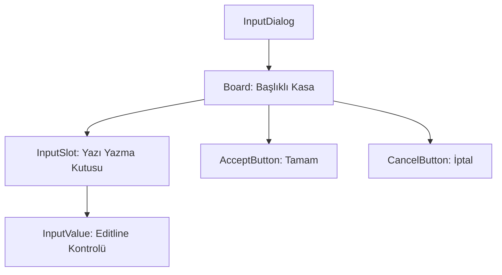

# 🎓 Metin2 Skills: `inputdialog.py` (Genel Giriş Penceresi)

`inputdialog.py`, oyunda kullanıcıdan basit bir metin veya sayı girmesi istendiğinde (Örn: Arkadaş eklerken isim yazma, miktar belirtme) kullanılan joker penceredir.

---

## 🔍 Neleri Yönetir?

### 1. Giriş Alanı (`InputSlot` & `InputValue`)
- **`type : editline`**: Kullanıcının klavye ile yazı yazabildiği asıl alandır.
- **`input_limit : 12`**: Varsayılan olarak 12 karakterlik bir sınır barındırır.
- **`slotbar`**: Giriş alanının etrafındaki koyu renkli çerçeveyi oluşturur.

### 2. Onay ve İptal Butonları
Girilen veriyi işleme sokan (`AcceptButton`) veya vazgeçen (`CancelButton`) butonlardır.

### 3. Başlıklı Panel (`board_with_titlebar`)
Pencere, bir başlık çubuğuna sahiptir. Başlık metni kod tarafında dinamik olarak (Örn: "İsim Giriniz") doldurulur.

---

## 🛠️ Modifikasyon ve Kritik Uyarılar

### ✅ Sayı Girişi Kısıtlaması:
Eğer bu pencerenin sadece rakam kabul etmesini istiyorsan, `root/uicommon.py` içindeki `InputDialog` sınıfında `InputValue.SetNumberMode()` fonksiyonunu çağırmalısın.

### ⚠️ Genişlik Ayarı:
Eğer uzun bir metin girişi gerekiyorsa (Örn: Pazar ismi), `width: 170` değerini artırıp `InputSlot` ve `InputValue` genişliklerini de buna paralel olarak büyütmelisin.

---

## 📉 inputdialog.py Tasarım Hiyerarşisi

---

**Veri Akışı:** `Oyuncu Girdisi` -> `root/uicommon.py` -> `Çeşitli Sistemler`.
