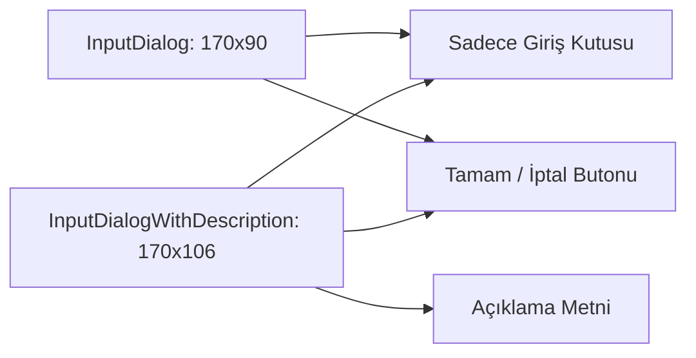

# 🎓 Metin2 Skills: `inputdialog.py` & `inputdialogwithdescription.py` (Metin Giriş Pencereleri)

Bu iki dosya, oyun içinde oyuncunun bir metin veya sayı girmesi gerektiğinde (Örneğin: Lonca adı belirleme, Eşya ayırma miktarı girme, Komut yazma) açılan küçük veri giriş pencereleridir.

---

## 🔍 Neleri Yönetirler?

### 1. Metin Kutusu (`InputValue`)
`editline` tipinde bir giriş alanıdır. Oyuncunun klavyesiyle metin yazabildiği tek alandır.
- **`input_limit : 12`**: Varsayılan olarak 12 karakter girilmesine izin verilir. Bu sınır, giriş penceresinin nerede kullanıldığına bağlı olarak Python tarafında (`uiCommon.py`) değiştirilebilir.

### 2. Açıklama Metni (`Description`)
Sadece `inputdialogwithdescription.py` dosyasında bulunur. Ne girilmesi gerektiğini anlatan (Örn: "Kaç adet ayırmak istiyorsun?") başlık metnini yönetir.

### 3. Ortalanmış Butonlar (`AcceptButton` & `CancelButton`)
"Tamam" ve "İptal" butonları, pencerenin alt kısmında simetrik ve ortalanmış şekilde durur.

---

## 🛠️ Modifikasyon ve Kritik Uyarılar

### ✅ Input Limitine Dikkat:
Eğer bu pencereleri özel bir sistem (Örneğin: 20 haneli Hediye Kodu girme) için kullanacaksan, `input_limit` değerini artırman gerekir. Aksi halde oyuncu 12. karakterden sonrasını yazamaz.

### ⚠️ Gizli Şifre Girişleri:
Bu pencere varsayılan olarak yazılan metni gösterir (Düz metin). Eğer şifre girişi için kullanılacaksa (yıldızlı `***` görünüm), Python kodunda `SetSecret(True)` metodu çağrılmalıdır; bu `.py` tasarım dosyasından tek başına yapılamaz.

---

## 📉 Yapısal Karşılaştırma

**Sonuç:** Bu dosyalar, oyun motorunun oyuncudan "Dinamik Veri" aldığı köprülerdir. Kullanıcı dostu ve net olmaları gerekir.
