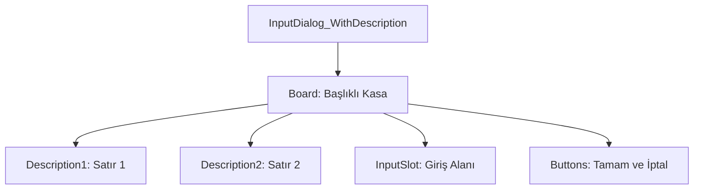

# 🎓 Metin2 Skills: `inputdialogwithdescription2.py` (Açıklamalı Giriş Penceresi v2)

`inputdialogwithdescription2.py`, standart giriş penceresine ek olarak kullanıcıya iki satırlık bir açıklama metni sunan gelişmiş giriş diyaloğudur.

---

## 🔍 Neleri Yönetir?

### 1. Çift Satır Açıklama (`Description1` & `Description2`)
Kullanıcıya ne girmesi gerektiğini daha detaylı açıklamak için kullanılır.
- **`Description1`**: Üst satır metni.
- **`Description2`**: Alt satır metni (`TEMPORARY_HEIGHT` kadar aşağıda konumlanır).

### 2. Dinamik Yükseklik (`TEMPORARY_HEIGHT`)
Açıklama satırlarının eklenmesiyle pencerenin boyutu (`106 + 16`) otomatik olarak uzatılır. Bu sayede butonlar ve giriş alanı metinlerin altında kalmaz.

### 3. Giriş Alanı (`InputSlot`)
Standart 12 karakterlik `editline` yapısını korur.

---

## 🛠️ Modifikasyon ve Kritik Uyarılar

### ✅ Çoklu Bilgi Sunma:
Bu pencere genellikle güvenlik soruları (Örn: "Şifreniz nedir? (Dikkat: Kimseyle paylaşmayın)") gibi hem soru hem de uyarı içeren durumlarda tercih edilir.

### ⚠️ Hizalama:
`horizontal_align : center` parametresi kullanıldığı için, pencere genişliği (`width`) değişse bile içerideki tüm bileşenler otomatik olarak ortalanmaya devam eder.

---

## 📉 inputdialogwithdescription2.py Tasarım Hiyerarşisi

---

**Veri Akışı:** `Kod Tarafı (Soru + Uyarı)` -> `root/uicommon.py` -> `inputdialogwithdescription2.py`.
