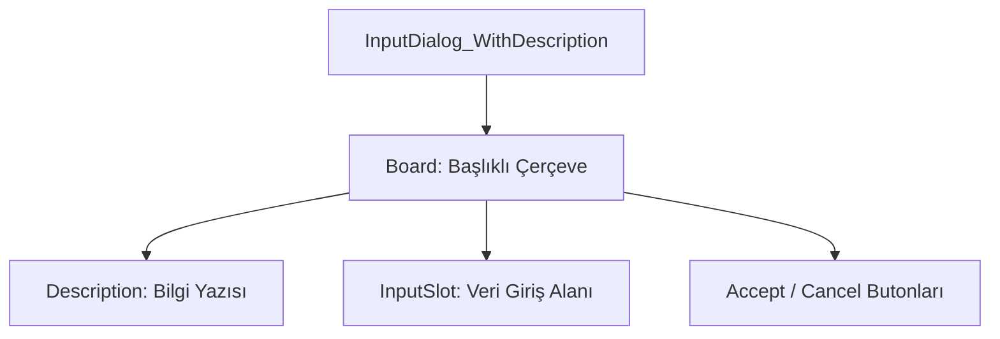

# 🎓 Metin2 Skills: `inputdialogwithdescription.py` (Açıklamalı Giriş Penceresi)

`inputdialogwithdescription.py`, oyuncudan bir metin veya sayı girişi istenirken üzerinde açıklayıcı bir bilgi yazısı bulunan genel amaçlı (Generic) bir diyalog penceresidir.

---

## 🔍 Neleri Yönetir?

### 1. Dinamik Açıklama (`Description`)
Giriş alanının hemen üzerinde yer alan ve ne girilmesi gerektiğini belirten ("Lütfen şifrenizi girin", "Miktar yazın" vb.) dinamik metin alanıdır.

### 2. Giriş Alanı (`InputValue`)
Kullanıcının veri yazdığı `editline` kısmıdır. Genellikle 12 karakterlik bir `input_limit` ile sınırlandırılmıştır.

### 3. Esnek Kullanım
Bu dosya tek başına bir iş yapmaz. `root/uicommon.py` içindeki `InputDialogWithDescription` sınıfı tarafından çağrılarak, o anki ihtiyaca göre başlık ve açıklama metni ile doldurulur.

---

## 🛠️ Modifikasyon ve Kritik Uyarılar

### ✅ Pencereyi Genişletme:
Eğer girilen veri 12 karakterden uzunsa (Örn: E-posta adresi), `InputSlot` genişliğini ve `width` değerini artırarak pencereyi yatayda büyütebilirsin.

### ⚠️ Boş Başlık:
Tasarım dosyasında `title` boştur. Bunun nedeni, bu pencerenin çok farklı amaçlar için (Banka şifresi, Nesne kodlama vb.) kullanılması ve başlığın kod tarafında anlık olarak atanmasıdır.

---

## 📉 inputdialogwithdescription.py Tasarım Hiyerarşisi

---

**Veri Akışı:** `root/uicommon.py` -> `inputdialogwithdescription.py` -> Ekran.
