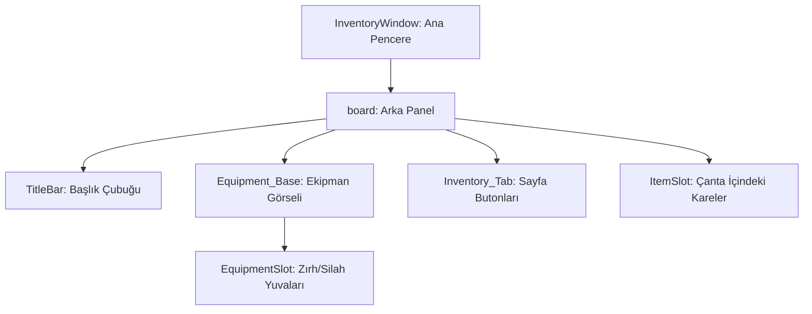

# 🎓 Metin2 Skills: `inventorywindow.py` (Envanter Tasarımı)

`inventorywindow.py`, oyuncunun çantasını (Envanter) ve üzerindeki ekipman slotlarını (Zırh, Silah vb.) ekranda nereye koyacağını ve nasıl görüneceğini belirleyen "Mimari Plan" dosyasıdır.

---

## 🔍 Neleri Yönetir?

### 1. Pencere Konumu ve Boyutu (`window`)
Envanterin ekranın sağ tarafında (`SCREEN_WIDTH - 176`) nerede duracağını ve toplam genişlik/yükseklik değerlerini belirler.

### 2. Ekipman Slotları (`EquipmentSlot`)
Kask, Zırh, Silah, Kalkan gibi eşyaların envanterin üst kısmında hangi koordinatlarda duracağını tek tek belirler.
- **`index`**: Bu değer `EQUIPMENT_START_INDEX` (90) ile başlar. Her numara farklı bir vücut bölgesini temsil eder.

### 3. Görsel Temalar (`image`)
Envanterin arka planını ve slotların etrafındaki çerçeveleri belirleyen `.sub` dosyalarını tanımlar.
- **Örnek:** `equipment_base.sub` (Zırhların arkasındaki gri gölge).

### 4. Sayfa Sekmeleri (`radio_button`)
Envanter 1 ve Envanter 2 sayfaları arasında geçiş yapmayı sağlayan butonların konumlarını ve görsellerini yönetir.

---

## 🛠️ Modifikasyon ve Kritik Uyarılar

### ✅ Yeni Buton Ekleme:
Envanterin altına "Hızlı Sat" veya "Depo Aç" gibi bir buton eklemek istersen, `children` listesinin en sonuna yeni bir `button` bloğu eklemelisin.

### ✅ Slot Yerlerini Değiştirme:
Eğer zırhın veya kalkanın yerini beğenmiyorsan, `EquipmentSlot` içindeki `x` ve `y` değerlerini değiştirerek onları milimetrik olarak kaydırabilirsin.

### ⚠️ Koordinat Taşmaları:
Eğer bir butonun koordinatını ana pencerenin (`width` / `height`) dışına yazarsan, buton ekranda görünmez veya tıklanamaz olur.

---

## 🚨 Hata Ayıklama (Debug)

**"Envanteri açıyorum ama bomboş görünüyor" sorunu:**
1.  `inventorywindow.py` içinde bir parantez hatası `( , )` veya virgül hatası olup olmadığını kontrol et. Bu dosya bir Python sözlüğü (Dictionary) olduğu için yazım hataları tüm arayüzü bozar.
2.  `image` yollarının `d:/ymir work/...` şeklinde doğru başladığından emin ol.

---

## 📉 inventorywindow.py Tasarım Hiyerarşisi

---

**Sonuç:** `inventorywindow.py`, oyuncunun en çok baktığı ekranın "Dizaynıdır". Buradaki düzenlemeler kullanıcı deneyimini (UX) doğrudan etkiler.
