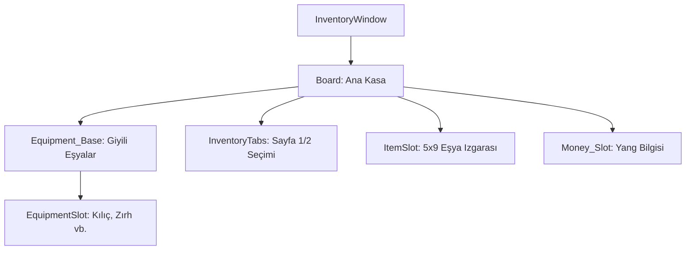

# 🎓 Metin2 Skills: `inventorywindow.py` (Envanter Sistemi)

`inventorywindow.py`, oyuncunun sahip olduğu eşyaları, giydiği ekipmanları ve parasını yönettiği ana arayüz dosyasıdır. Oyunun en çok kullanılan ve en kompleks pencerelerinden biridir.

---

## 🔍 Neleri Yönetir?

### 1. Ekipman Bölümü (`EquipmentSlot`)
Karakterin üzerine giydiği zırh, kılıç, kask gibi eşyaların yerleştiği özel slotlardır.
- **`index`**: Her slotun (`EQUIPMENT_START_INDEX + n`) kendine has bir kimlik numarası vardır.
- **`equipment_base.sub`**: Ekipman slotlarının arka planındaki insan figürlü görseli yönetir.

### 2. Sayfalı Envanter Yapısı (`Inventory_Tab`)
Metin2 envanteri genellikle iki veya daha fazla sayfadan oluşur.
- **`ItemSlot` (Grid Table)**: 5x9 boyutundaki ana eşya deposudur. `x_count: 5` ve `y_count: 9` değerleri toplam 45 slotluk bir sayfa oluşturur.

### 3. Yang Göstergesi (`Money_Slot`)
Karakterin o anki parasını (`Money`) gösteren ve yanındaki altın ikonuyla (`money_icon.sub`) desteklenen alandır.

---

## 🛠️ Modifikasyon ve Kritik Uyarılar

### ✅ Envanter Sayfası Artırma:
Eğer envanteri 4 sayfaya çıkarmak istiyorsan, buraya `Inventory_Tab_03` ve `04` butonlarını eklemeli ve `root/uiinventory.py` tarafında bu butonların tetikleyeceği sayfa geçişlerini tanımlamalısın.

### ⚠️ Slot Çakışması:
Slotların `x` ve `y` koordinatları birbirinin üzerine binmemelidir. Aksi halde eşyalar üst üste biner ve sürükle-bırak işlemleri hatalı çalışır.

---

## 📉 inventorywindow.py Tasarım Hiyerarşisi

---

**Veri Akışı:** `Server (Item Data)` -> `root/uiinventory.py` -> `inventorywindow.py` -> Ekran.
