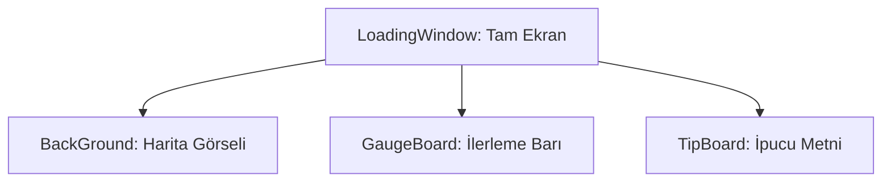

# 🎓 Metin2 Skills: `loadingwindow.py` (Yükleme Ekranı Tasarımı)

`loadingwindow.py`, harita değiştirilirken veya oyuna ilk girilirken görünen yükleme ekranının tasarım dosyasıdır.

---

## 🔍 Neleri Yönetir?

### 1. Yükleme Barı (`GaugeBoard`)
Yüklemenin yüzde kaçta olduğunu gösteren ilerleme çubuğunun konumunu ve boyutunu belirler.

### 2. Arka Plan Görseli
Yükleme sırasında gösterilen tam ekran arka plan resminin yerleşimini yönetir. Genellikle harita bazlı farklı görseller gösterilir.

### 3. İpucu Metni (`TipBoard`)
"Biliyor muydunuz?" tarzı oyun ipuçlarının gösterildiği metin alanını düzenler.

---

## 🛠️ Modifikasyon ve Kritik Uyarılar

### ✅ Yükleme Ekranı Görseli Değiştirme:
Arka plan görseli genellikle `introLoading.py` veya `networkModule.py` tarafından dinamik olarak ayarlanır. Bu dosya sadece çerçeveyi belirler.

### ⚠️ Bar Boyutu:
Yükleme barının genişliğini artırırsan, yüzde hesaplamasının doğru görünmesi için `uiLoading.py` kodunda da güncelleme yapmalısın.

---

## 📉 loadingwindow.py Yapısı

---

**Sonuç:** `loadingwindow.py`, oyuncunun sabırla beklediği "Geçiş Kapısı"dır. İyi tasarlanmış bir yükleme ekranı bekleme süresini daha az sıkıcı kılar.
