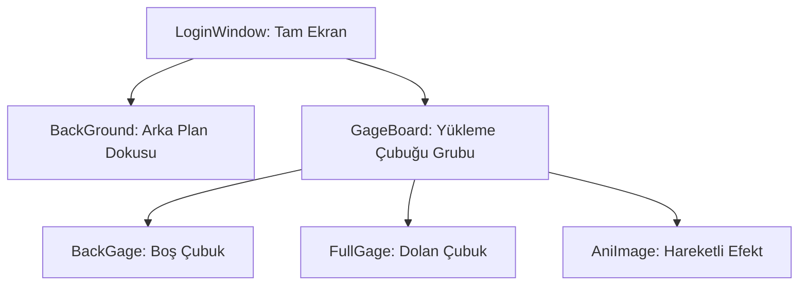

# 🎓 Metin2 Skills: `loadingwindow.py` (Yükleme Çubuğu ve Ekranı)

`loadingwindow.py`, oyun haritaları yüklenirken ekranda dolan o meşhur sarı çubuğu (Gauge) ve arka plandaki dokuyu yöneten tasarım dosyasıdır.

---

## 🔍 Neleri Yönetir?

### 1. Yükleme Çubuğu (`GageBoard`)
İki ana parçadan oluşur:
- **`gauge_empty.sub`**: Çubuğun boş, gri halidir.
- **`gauge_full.sub`**: Yükleme ilerledikçe dolan, renkli (Genellikle sarı) kısımdır. `root` tarafındaki `SetPercentage` fonksiyonu ile bu resmin genişliği dinamik olarak artırılır.

### 2. Hareketli Arka Plan (`BackGage` Ani Image)
Çubuğun hemen arkasında veya üstünde dönen küçük bir animasyonu (`00.sub`'dan `23.sub`'a kadar) yönetir. Bu, oyunun donmadığını oyuncuya hissettirmek için kullanılan bir micro-animasyondur.

### 3. Ölçeklendirme (`x_scale`, `y_scale`)
Pencere, oyuncunun ekran çözünürlüğüne (Örn: 1920x1080) otomatik olarak genişleyecek şekilde matematiksel olarak ölçeklendirilir.

---

## 🛠️ Modifikasyon ve Kritik Uyarılar

### ✅ Özel Loading Bar Yapımı:
Eğer standart sarı çubuğu değiştirmek istiyorsan, `gauge_full.sub` ve `gauge_empty.sub` dosyalarını kendi tasarımınla değiştirebilirsin. Boyutları değiştirirsen `.py` içindeki `width` ve `height` değerlerini de güncellemelisin.

### ⚠️ Hata Mesajı:
`ErrorMessage` alanı, eğer harita dosyaları yüklenemezse ekranda beliren "Yükleme Hatası" yazısını tutar.

---

## 📉 loadingwindow.py Tasarım Hiyerarşisi

---

**Veri Akışı:** `root/introloading.py` -> `loadingwindow.py` -> `Oyun Motoru (Loading Thread)`.
