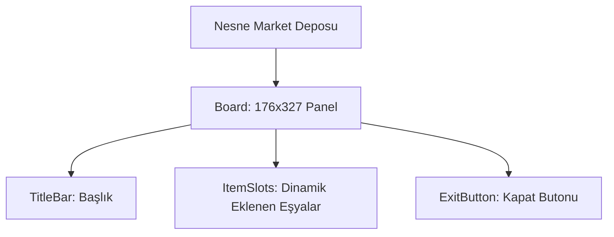

# 🎓 Metin2 Skills: `mallwindow.py` (Nesne Market Deposu)

`mallwindow.py`, oyuncunun Nesne Market'ten (Item Shop) satın aldığı eşyaların gönderildiği "Nesne Market Deposu" arayüzünün tasarım dosyasıdır.

---

## 🔍 Neleri Yönetir?

### 1. Ana Çerçeve (`SafeboxWindow` referansı)
Bu pencerenin iç yapısı aslında `SafeboxWindow` (Depo) ile aynı mantıkta çalışır. İsmi `SafeboxWindow` olarak tanımlanmıştır ancak Nesne Market Deposu için özel olarak çağrılır. Boyutları `176x327`'dir.

### 2. Başlık ve Kapat Butonu
- **`TitleBar`**: "Nesne Market Deposu" başlığını içerir.
- **`ExitButton`**: Alt kısımda bulunan Kapat butonunu yönetir.

---

## 🛠️ Modifikasyon ve Kritik Uyarılar

### ⚠️ Depo ile Karışıklık:
Bu dosyanın kod içi `name` değeri `"SafeboxWindow"` olarak bırakılmıştır. Bu, Metin2'nin klasik copy-paste mirasıdır. Eşyaların yerleştirileceği slotlar (ızgara) Python kodunda dinamik olarak bu pencereye eklenir.

## 📉 mallwindow.py Yapısı

