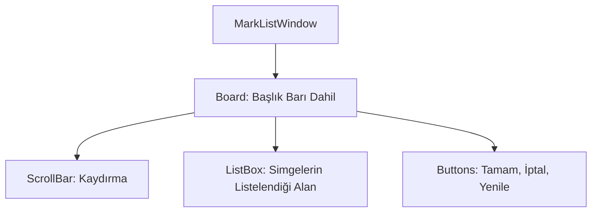

# 🎓 Metin2 Skills: `marklistwindow.py` (Lonca Simgesi Seçimi)

`marklistwindow.py`, lonca liderinin lonca arazisine veya lonca isminin yanına koyacağı simgeyi (Logo) seçtiği penceredir.

---

## 🔍 Neleri Yönetir?

### 1. Simge Listesi
`upload/` klasöründeki 16x12 boyutundaki `.tga` veya `.jpg` dosyalarını listeler.

### 2. Yenileme Butonu (`refresh`)
Yeni bir simge yüklendiğinde listeyi anlık olarak günceller.

### 3. Kaydırma Çubuğu (`ScrollBar`)
Çok sayıda simge arasından seçim yapmayı kolaylaştırır.

---

## 🛠️ Modifikasyon ve Kritik Uyarılar

### ✅ Yeni Simgeler Ekleme:
Kendi sunucuna özel lonca simgeleri eklemek istiyorsan, bu simgeleri istemcinin `upload/` klasörüne atmalısın. Pencere bu klasörü otomatik olarak tarar.

### ⚠️ Boyut Sınırı:
Lonca simgeleri standart olarak **16x12** piksel olmalıdır. Daha büyük veya küçük resimler listede bozuk görünebilir veya sunucu tarafından reddedilebilir.

---

## 📉 marklistwindow.py Tasarım Hiyerarşisi

---

**Veri Akışı:** `İstemci / upload` -> `root/uiuploadmark.py` -> `marklistwindow.py` -> `Server (Logo Upload)`.
