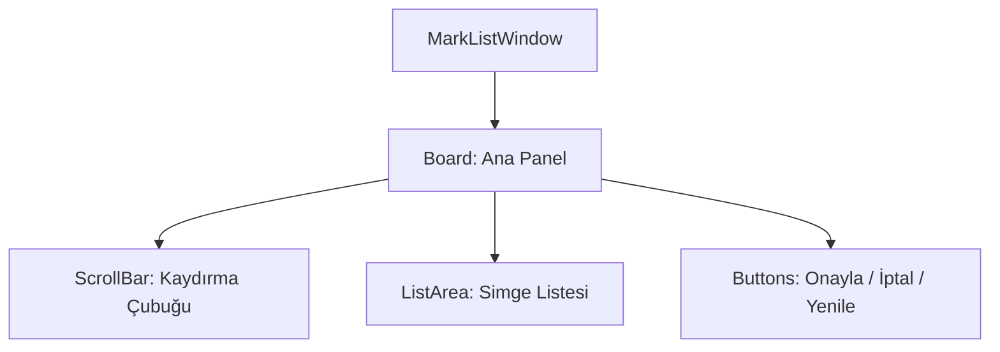

# 🎓 Metin2 Skills: `marklistwindow.py` (Lonca Simgesi Seçimi)

`marklistwindow.py`, lonca başkanlarının lonca simgesi (Mark) belirlemek için tıkladıklarında açılan, mevcut simgelerin listelendiği pencerenin tasarımıdır.

---

## 🔍 Neleri Yönetir?

### 1. Simge Listesi ve Kaydırma (`ScrollBar`)
`upload/` klasörüne atılan `16x12` piksel boyutundaki görsellerin listeleneceği bir alanı ve bu alanda kaydırmayı sağlayan barı yönetir.

### 2. İşlem Butonları
- **`ok`**: Seçilen simgeyi onaylar.
- **`cancel`**: İşlemi iptal eder.
- **`refresh`**: Listeyi yeniler (oyuncu klasöre yeni simge attığında oyunu kapatmadan görmesini sağlar).

---

## 🛠️ Modifikasyon ve Kritik Uyarılar

### ⚠️ Boyutlar ve Kapasite:
Lonca simgelerinin boyutları sabittir (`16x12`). Bu pencerenin boyutu (`170x300`) liste görünümü içindir; eğer listelemeyi kare şeklinde yapmak istersen Python tarafında da UI değişikliği gerekir.

## 📉 marklistwindow.py Yapısı

