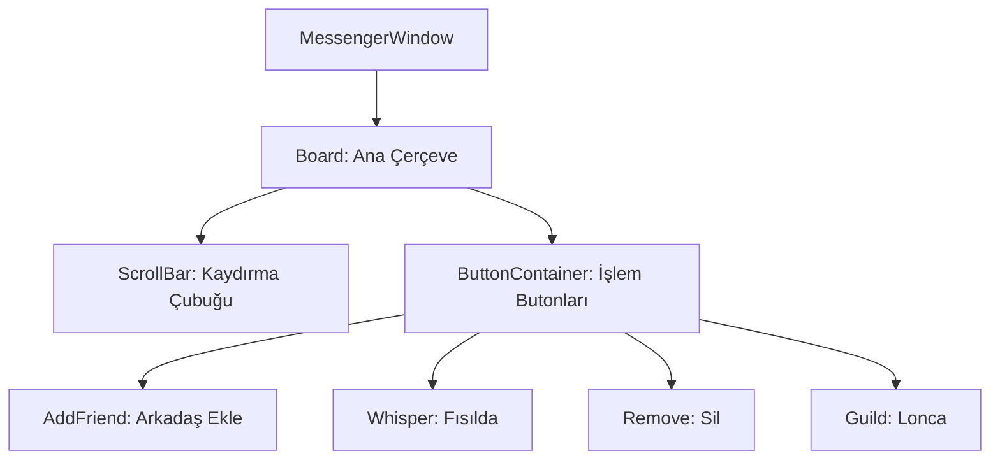

# 🎓 Metin2 Skills: `messengerwindow.py` (Arkadaş Listesi Tasarımı)

`messengerwindow.py`, oyuncuların arkadaş listesini, lonca üyelerini ve engellenen kişileri gördüğü "Messenger" (Alt+M) panelinin tasarım dosyasıdır.

---

## 🔍 Neleri Yönetir?

### 1. Liste Kaydırma (`ScrollBar`)
Arkadaş sayısı pencere boyundan fazla olduğunda, listede aşağı-yukarı hareket etmeyi sağlayan kaydırma çubuğunun konumunu belirler.

### 2. İşlem Butonları (Alt Bar)
Pencerenin en altında bulunan şu fonksiyonel butonları yönetir:
- **Arkadaş Ekle (`AddFriendButton`)**
- **Mesaj Gönder (`WhisperButton`)**
- **Arkadaşı Sil (`RemoveButton`)**
- **Lonca Penceresini Aç (`GuildButton`)**

### 3. Dinamik Hizalama (`BUTTON_X_STEP`)
Butonların yan yana düzgün bir şekilde dizilmesi için matematiksel bir adım (Örn: Her buton arası 30 piksel) kullanır. Bu sayede buton eklemek veya çıkarmak çok daha kolaydır.

### 4. İpucu Metinleri (`tooltip_text`)
Fareyle bir butonun üzerine gelindiğinde çıkan "Arkadaş Ekle" gibi açıklama kutucuklarının içeriğini ve konumunu belirler.

---

## 🛠️ Modifikasyon ve Kritik Uyarılar

### ✅ Yeni Özellik Ekleme:
Messenger'a "Gruba Davet Et" veya "Engelle" gibi yeni bir buton eklemek istersen, `BUTTON_X_STEP` çarpımını bir artırarak yeni bir buton bloğu ekleyebilirsin.

### ✅ Pencereyi Genişletme:
Arkadaş listesinin daha geniş görünmesini istiyorsan `width` değerini (Örn: 170'ten 250'ye) artırmalısın. Tabii bu durumda `board` ve `titlebar` genişliklerini de güncellemen gerekir.

### ⚠️ Görsel Senkronizasyonu:
Butonların `.sub` dosyaları (messenger_add_friend_01.sub vb.) eksikse butonlar görünmez olur veya oyun hata verir.

---

## 🚨 Hata Ayıklama (Debug)

**"Butonlar pencerenin dışına taşıyor" sorunu:**
1.  `BUTTON_START_X_POS` değerini kontrol et. Eğer çok küçükse butonlar soldan dışarı taşar.
2.  `horizontal_align` değerinin "center" olduğundan emin ol, bu sayede pencere büyüdüğünde butonlar ortalı kalır.

---

## 📉 messengerwindow.py Bileşen Yapısı

---

**Sonuç:** `messengerwindow.py`, oyunun "Sosyal Rehberidir". Oyuncuların birbirleriyle iletişim kurmasını sağlayan araçların düzenini belirler.
