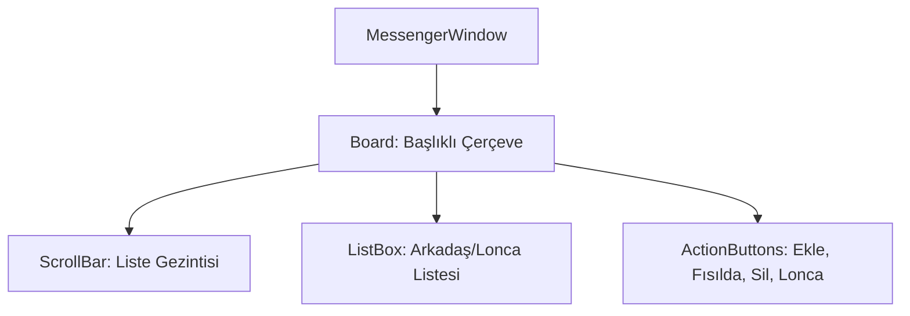

# 🎓 Metin2 Skills: `messengerwindow.py` (Arkadaş Listesi / Messenger)

`messengerwindow.py`, oyuncunun arkadaşlarını, lonca üyelerini ve engellediği kişileri yönettiği sosyal iletişim panelidir.

---

## 🔍 Neleri Yönetir?

### 1. Liste Yapısı ve Kaydırma (`ScrollBar`)
Arkadaşların ve lonca üyelerinin isimlerinin, seviyelerinin ve çevrimiçi (Online/Offline) durumlarının listelendiği alanı yönetir.

### 2. Fonksiyonel Butonlar
Panelin alt kısmında (`vertical_align : bottom`) yer alan butonlar şunlardır:
- **`AddFriendButton`**: Yeni bir arkadaş eklemek için kullanılır.
- **`WhisperButton`**: Seçili kişiye fısıltı göndermeyi sağlar.
- **`RemoveButton`**: Seçili kişiyi listeden siler.
- **`GuildButton`**: Lonca penceresini hızlıca açmak için kullanılır.

### 3. İpucu Metinleri (`Tooltip`)
Butonların üzerine gelindiğinde ne işe yaradıklarını gösteren metinlerin konumlarını (`tooltip_x`, `tooltip_y`) belirler.

---

## 🛠️ Modifikasyon ve Kritik Uyarılar

### ✅ Buton Aralığı (`BUTTON_X_STEP`):
Eğer yeni bir sosyal özellik (Örn: "Takım" veya "Blok Listesi") butonu eklemek istersen, `BUTTON_X_STEP` değerini kullanarak butonları yan yana hizalayabilirsin.

### ⚠️ Liste Dinamiği:
Bu pencerenin içeriği (İsimler ve durumlar) dinamik olarak `root/uimessenger.py` tarafından doldurulur. `.py` dosyasında sadece bu verilerin nerede duracağı (Koordinatlar) tanımlıdır.

---

## 📉 messengerwindow.py Tasarım Hiyerarşisi

---

**Veri Akışı:** `Server (Social Packets)` -> `root/uimessenger.py` -> `messengerwindow.py` -> Ekran.
