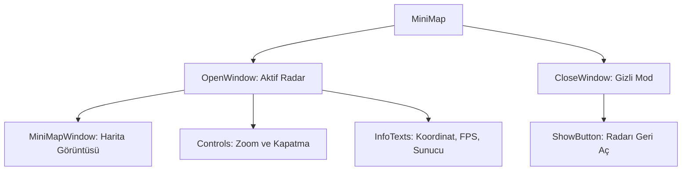

# 🎓 Metin2 Skills: `minimap.py` (Mini Harita ve Radar)

`minimap.py`, ekranın sağ üst köşesinde bulunan, oyuncunun konumunu, çevredeki varlıkları (Canavarlar, NPC'ler, Metin taşları) ve harita bilgilerini gösteren radar arayüzüdür.

---

## 🔍 Neleri Yönetir?

### 1. Mini Harita Katmanları
- **`OpenWindow`**: Radar açıkken görünen tüm bileşenleri (Harita, butonlar, metinler) barındırır.
- **`MiniMapWindow`**: Asıl harita görüntüsünün (128x128) çizildiği dinamik penceredir.
- **`OpenWindowBGI`**: Radarın etrafındaki dairesel çerçeveyi (`minimap.sub`) yönetir.

### 2. Kontrol Butonları
- **`ScaleUp / ScaleDown`**: Haritayı yakınlaştırıp uzaklaştırmayı sağlar.
- **`MiniMapHideButton`**: Radarı kapatıp (`CloseWindow` moduna geçip) sadece küçük bir butonun kalmasını sağlar.
- **`AtlasShowButton`**: Büyük haritayı (`M` tuşu ile açılan Atlas) tetikler.

### 3. Bilgi Metinleri (`PositionInfo`, `ServerInfo`)
Oyuncunun o anki koordinatlarını (X, Y), bulunduğu sunucuyu (CH), FPS değerini ve çevredeki izleyici sayısını gösteren metin alanlarıdır.

---

## 🛠️ Modifikasyon ve Kritik Uyarılar

### ✅ Radar Tasarımını Değiştirme:
Dairesel radar yerine kare bir radar yapmak istersen `minimap.sub` dosyasını ve `MiniMapWindow` boyutlarını buna göre güncellemelisin.

### ⚠️ Koordinat Senkronizasyonu:
`PositionInfo` metni, `root/uiminimap.py` tarafından her karede (onUpdate) güncellenir. Bu metnin rengini veya yazı tipini değiştirmek istiyorsan buradaki `text` bloğuna müdahale edebilirsin.

---

## 📉 minimap.py Tasarım Hiyerarşisi

---

**Veri Akışı:** `Oyun Motoru (Radar Verisi)` -> `root/uiminimap.py` -> `minimap.py` -> Ekran.
