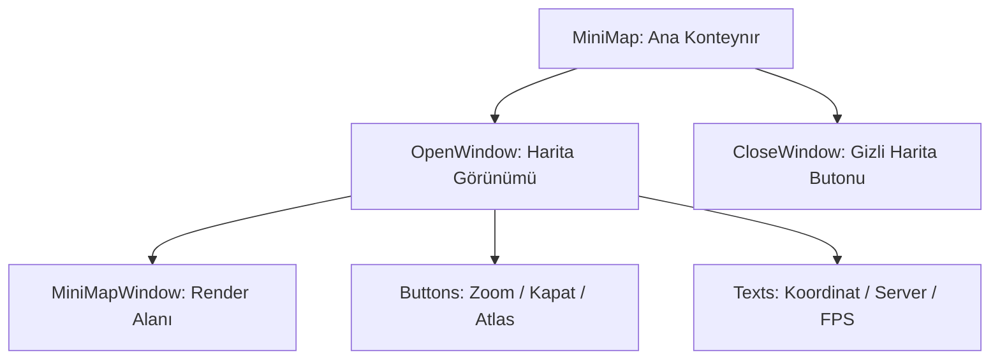

# 🎓 Metin2 Skills: `minimap.py` (Mini Harita Tasarımı)

`minimap.py`, ekranın sağ üst köşesinde bulunan küçük haritanın (Minimap), yakınlaştırma butonlarının ve koordinat bilgilerinin tasarım dosyasıdır.

---

## 🔍 Neleri Yönetir?

### 1. Harita Penceresi (`MiniMapWindow`)
Oyun motorunun harita görselini (Top-down view) çizdiği ana penceredir. Genellikle 128x128 boyutlarındadır.

### 2. Ölçekleme Butonları (`ScaleUp` & `ScaleDown`)
Haritayı yakınlaştırıp uzaklaştırmaya yarayan '+' ve '-' butonlarının konumlarını belirler.

### 3. Dinamik Metin Bilgileri
Haritanın hemen altında veya üzerinde görünen şu verileri yönetir:
- **`ServerInfo`**: Sunucu ve Kanal (CH) adı.
- **`PositionInfo`**: Karakterin o anki X ve Y koordinatları.
- **`FPSBilgi`**: Oyunun saniyelik kare hızı (FPS).

### 4. Atlas Butonu (`AtlasShowButton`)
Büyük dünya haritasını (M tuşu) açan butonun konumunu ve görselini belirler.

---

## 🛠️ Modifikasyon ve Kritik Uyarılar

### ✅ Koordinat Yerleşimi:
Koordinatların haritanın çok altında kaldığını düşünüyorsan, `PositionInfo` içindeki `y` değerini azaltarak onları haritanın içine veya hemen altına çekebilirsin.

### ✅ Yeni Bilgiler Ekleme:
Harita altına "Ping" veya "Oyun Saati" gibi yeni bilgiler eklemek istersen, `FPSBilgi` bloğunu kopyalayıp `y` koordinatını artırarak yeni bir metin alanı oluşturabilirsin.

### ⚠️ Görünürlük Durumları:
Bu dosyada iki ana grup vardır: `OpenWindow` (Harita açıkken) ve `CloseWindow` (Harita gizliyken). Eğer haritayı gizlediğinde butonun yerini değiştirmek istersen `CloseWindow` içindeki koordinatlara bakmalısın.

---

## 🚨 Hata Ayıklama (Debug)

**"Harita üzerindeki butonlara tıklayamıyorum" sorunu:**
1.  `MiniMapWindow` (Harita alanı) bazen diğer butonların üzerine biner. Butonların koordinatlarının harita alanıyla çakışmadığından emin ol.
2.  Buton görsellerinin (`.sub`) yolunun doğru olduğunu kontrol et.

---

## 📉 minimap.py Katman Yapısı

---

**Sonuç:** `minimap.py`, oyuncunun oyun dünyasındaki "Gözüdür". Doğru bir minimap yerleşimi, navigasyonu ve oyun konforunu artırır.
