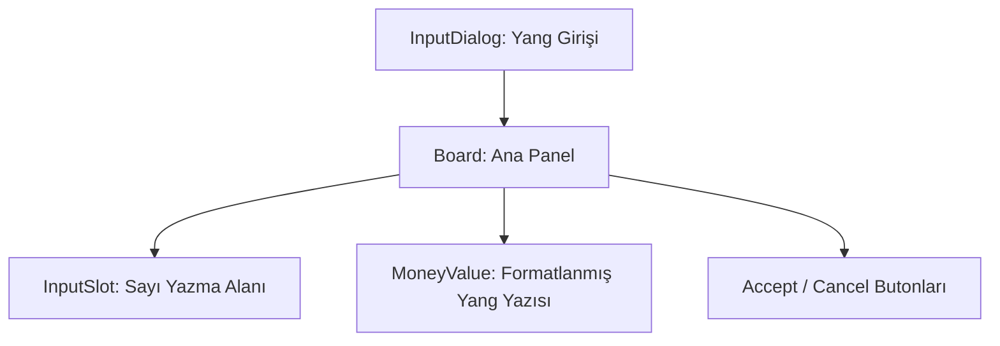

# 🎓 Metin2 Skills: `moneyinputdialog.py` (Yang Giriş Penceresi)

`moneyinputdialog.py`, oyuncunun ticaret yaparken, yere para atarken veya pazarda fiyat belirlerken Yang miktarını yazdığı özel giriş penceresidir.

---

## 🔍 Neleri Yönetir?

### 1. Sayı Giriş Alanı (`InputValue`)
Kullanıcının Yang miktarını yazdığı alandır. Genellikle sadece rakam girişine izin verecek şekilde `root` tarafında filtrelenir.
- **`input_limit : 12`**: Çok yüksek miktarlarda (Trilyonlar seviyesinde) Yang girişini destekleyecek uzunluktadır.

### 2. Anlık Miktar Göstergesi (`MoneyValue`)
Oyuncu sayı yazdıkça, bu sayının formatlanmış halini (Örn: `1.000.000`) alt kısımda göstererek hata yapılmasını engelleyen metin alanıdır.

### 3. Onay Butonları
Yang miktarını onaylar veya işlemi iptal eder.

---

## 🛠️ Modifikasyon ve Kritik Uyarılar

### ✅ Renkli Yang Gösterimi:
Eğer Yang miktarı çok yüksekse (Örn: 100M+), `MoneyValue` metninin rengini altın sarısı veya yeşil yaparak görsel okunabilirliği artırabilirsin. Bu işlem `root/uicommon.py` içindeki `MoneyInputDialog` sınıfında yapılır.

### ⚠️ Limit Kontrolü:
UI üzerinden 12 karakter yazılsa bile, oyuncunun üzerindeki paradan fazlasını yazması durumunda sistem işlemi engeller. Bu kontrol hem `root` hem de `server` tarafında yapılır.

---

## 📉 moneyinputdialog.py Tasarım Hiyerarşisi

---

**Veri Akışı:** `root/uicommon.py` -> `moneyinputdialog.py` -> `root/uiscriptlocale.py`.
