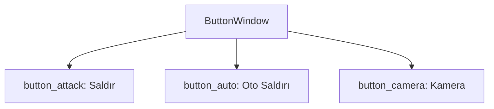

# 🎓 Metin2 Skills: `mousebuttonwindow.py` (Fare Fonksiyon Paneli)

`mousebuttonwindow.py`, oyunun sağ alt köşesindeki yetenek barının (Taskbar) yanında bulunan, farenin sol veya sağ tık işlevini değiştiren küçük dikey buton panelidir.

---

## 🔍 Neleri Yönetir?

### 1. Fare İşlev Butonları
Panelde üç ana mod bulunur:
- **`button_move_and_attack`**: Farenin standart hareket etme ve saldırma modudur.
- **`button_auto_attack`**: Otomatik saldırı modunu aktif eder.
- **`button_camera`**: Fare tıkıyla kamera açısını değiştirmeyi sağlar.

### 2. İpucu Metinleri (`Tooltip`)
Butonların üzerine gelindiğinde sol tarafta (`tooltip_x : -40`) görünen açıklama metinlerini yönetir.

### 3. Görsel Kaynaklar
Tüm buton görselleri `pack/ETC` içindeki `ymir work/ui/game/taskbar/` yolundan çekilir.

---

## 🛠️ Modifikasyon ve Kritik Uyarılar

### ✅ Yeni Fare Modu Ekleme:
Eğer oyuna yeni bir fare modu (Örn: "Seçim Modu") eklersen, buraya yeni bir buton ekleyip koordinatlarını `32, 64, 96...` şeklinde artırarak dikey listeyi büyütebilirsin.

### ⚠️ Görsel Senkronizasyon:
`default`, `over` ve `down` resimleri farklı `.sub` dosyalarıdır. Butona tıklandığında görselin değişmesi (basılı kalma efekti) kod tarafındaki `SetButton` fonksiyonları ile kontrol edilir.

---

## 📉 mousebuttonwindow.py Tasarım Hiyerarşisi

---

**Veri Akışı:** `root/uitaskbar.py` -> `mousebuttonwindow.py` -> `pack/ETC/taskbar`.
