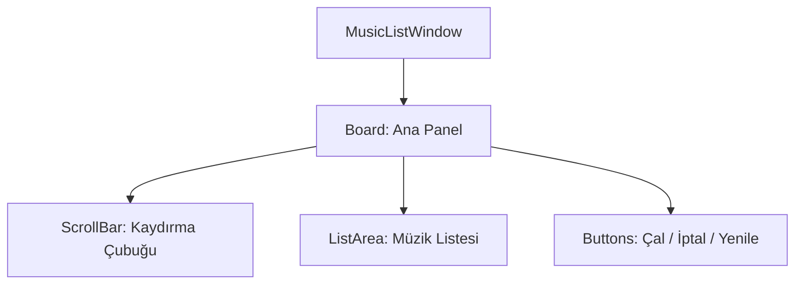

# 🎓 Metin2 Skills: `musiclistwindow.py` (Oyun İçi Müzik Seçimi)

`musiclistwindow.py`, sistem seçeneklerinden "Arka Plan Müziğini Değiştir" butonuna basıldığında açılan ve `.mp3` dosyalarını listeleyen pencerenin tasarımıdır.

---

## 🔍 Neleri Yönetir?

### 1. Ortak Mimari
Dosya yapısı, birebir `marklistwindow.py` ile aynıdır. Hatta kopyala-yapıştır yapıldığı için "Yenile" butonunun metni bile yanlışlıkla `uiScriptLocale.MARKLIST_REFRESH` (Lonca Simgesi Yenile) olarak kalmıştır!

### 2. Müzik Dosyaları
`BGM/` klasörü içindeki tüm müzikleri listeler ve seçildiğinde o müziği oynatır.

---

## 🛠️ Modifikasyon ve Kritik Uyarılar

### ✅ Dil Dosyası Hatası:
`refresh` butonundaki `MARKLIST_REFRESH` metnini `MUSICLIST_REFRESH` olarak düzeltmek, UI tasarımında daha profesyonel bir görünüm sunar.

## 📉 musiclistwindow.py Yapısı

