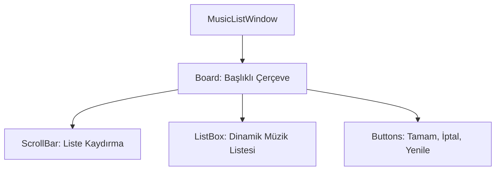

# 🎓 Metin2 Skills: `musiclistwindow.py` (Müzik Listesi)

`musiclistwindow.py`, oyun içinden arka plan müziğini (BGM) değiştirmek istediğinizde açılan ve `BGM/` klasöründeki müzikleri listeleyen penceredir.

---

## 🔍 Neleri Yönetir?

### 1. Dosya Listesi ve Kaydırma (`ScrollBar`)
Müzik dosyalarının (`.mp3`) listelendiği alanı ve bu listede gezinmeyi sağlayan kaydırma çubuğunu barındırır.

### 2. Yenileme Butonu (`refresh`)
Klasöre yeni bir müzik eklendiğinde listeyi güncelleyen "Yenile" butonudur.

### 3. Seçim Butonları (`ok`, `cancel`)
Seçilen müziği oynatır veya işlemi iptal eder.

---

## 🛠️ Modifikasyon ve Kritik Uyarılar

### ✅ Listeyi Genişletme:
Eğer çok fazla müziğin varsa, `height` değerini artırarak listenin daha fazla dosyayı aynı anda göstermesini sağlayabilirsin.

### ⚠️ BGM Klasörü:
Bu pencere sadece `pack/BGM` klasöründeki veya istemci ana dizinindeki `BGM/` klasöründeki dosyaları okur. Dosya formatı mutlaka `.mp3` olmalıdır.

---

## 📉 musiclistwindow.py Tasarım Hiyerarşisi

---

**Veri Akışı:** `pack/BGM` -> `root/uiselectmusic.py` -> `musiclistwindow.py` -> Ekran.
