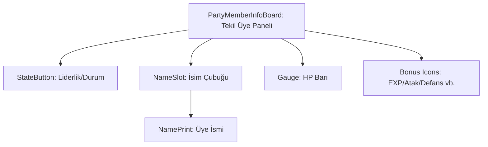

# 🎓 Metin2 Skills: `partymemberinfoboard.py` (Grup Üyesi Bilgi Paneli)

`partymemberinfoboard.py`, bir gruba (party) girdiğinde ekranın sol üstünde beliren her bir grup üyesinin ismini, canını (HP) ve aldığı grup bonuslarını gösteren küçük panelin tasarımıdır.

---

## 🔍 Neleri Yönetir?

### 1. Üye İsmi (`NameSlot`)
- **`type: bar`**: İsmin arkasındaki yarı saydam siyah şeridi tanımlar.
- **`NamePrint`**: Üyenin isminin yazıldığı metin alanıdır.

### 2. HP Barı (`Gauge`)
Grup üyesinin anlık can miktarını gösteren kırmızı bardır. `root` tarafındaki `uiparty.py` bu barın doluluk oranını sürekli günceller.

### 3. Durum ve Bonus İkonları (`ExperienceImage` vb.)
Grup liderinin verdiği bonuslara göre (Saldırı, Savunma, EXP vb.) üyenin altında beliren küçük ikonlardır.
- **`StateButton`**: Üyenin durumunu (Lider mi, üye mi) ve menüsünü açmayı sağlayan sol baştaki butondur.

### 4. Hizalama (`x: 22`)
Tüm elemanların `x` koordinatı genellikle 22'den başlar çünkü ilk 22 piksellik alan `StateButton` (Liderlik ikonu) için ayrılmıştır.

---

## 🛠️ Modifikasyon ve Kritik Uyarılar

### ✅ Görünüm İyileştirme:
Grup üyelerinin HP barlarını çok küçük buluyorsan, `Gauge` elemanının `width` değerini (şu an 84) artırarak daha uzun ve okunabilir barlar yapabilirsin.

### ⚠️ Üst Üste Binme:
Bonus ikonlarının (ExperienceImage, AttackerImage vb.) `x` değerleri 12'şer piksel arayla (22, 34, 46...) sıralanmıştır. Eğer yeni bir ikon eklersen bu aralığı korumalısın, aksi halde ikonlar birbirinin üzerine biner.

---

## 📉 partymemberinfoboard.py Tasarım Hiyerarşisi

---

**Veri Akışı:** `Server (Grup Paketleri)` -> `uiparty.py` (Logic) -> `partymemberinfoboard.py` (Görsel Slot) -> Ekran.
