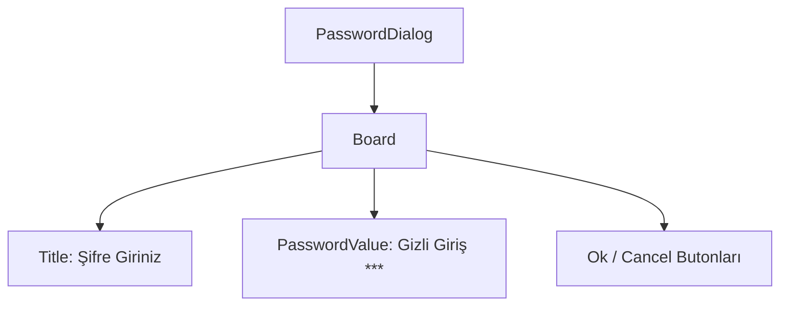

# 🎓 Metin2 Skills: `passworddialog.py` (Şifre Giriş Tasarımı)

`passworddialog.py`, oyuncunun depo şifresi veya karakter silme şifresi gibi gizli bilgiler girmesi gerektiğinde açılan ekranın tasarımıdır.

---

## 🔍 Neleri Yönetir?

### 1. Gizli Metin Girişi (`secret_flag : 1`)
`editline` içindeki bu bayrak sayesinde, oyuncunun yazdığı her karakter ekranda yıldız (`*`) olarak görünür. Şifrenin omuz sörfü (omuz arkasından bakma) veya yayınlarda ifşa olmasını engeller.

### 2. Şifre Uzunluğu (`input_limit : 6`)
Standart depo şifreleri 6 karakterdir. Bu sınır, oyuncunun gereğinden uzun bir şifre girip sunucu tarafında hata almasını veya veritabanında taşma olmasını önler.

---

## 🛠️ Modifikasyon ve Kritik Uyarılar

### ⚠️ Limit Değişikliği:
Eğer sunucunda 8 haneli şifrelere izin vermek istiyorsan sadece bu dosyayı değiştirmek yetmez. Oyun motorunun ve veritabanı (MySQL) tablolarının da bu uzunluğu desteklediğinden emin olmalısın.

## 📉 passworddialog.py Yapısı

