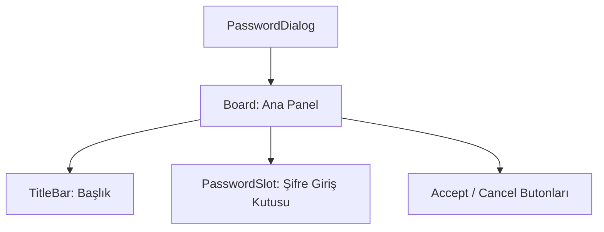

# 🎓 Metin2 Skills: `passworddialog.py` (Genel Şifre Girişi)

`passworddialog.py`, oyunda güvenlik gerektiren işlemler (Karakter silme, Depo açma vb.) için kullanılan tek satırlık standart şifre giriş penceresidir.

---

## 🔍 Neleri Yönetir?

### 1. Şifre Giriş Alanı (`password_value`)
Kullanıcının şifresini yazdığı alandır.
- **`secret_flag : 1`**: Şifrenin ekranda yıldızlarla gizlenmesini sağlar.
- **`input_limit : 6`**: Genellikle 6 karakter olan güvenlik şifrelerine göre sınırlanmıştır.

### 2. Standart Panel Yapısı
`TitleBar` ve `Accept/Cancel` butonlarıyla birlikte kompakt bir tasarıma sahiptir.

---

## 🛠️ Modifikasyon ve Kritik Uyarılar

### ✅ Çok Amaçlı Kullanım:
Bu dosya, `root/uicommon.py` içindeki `PasswordDialog` sınıfı tarafından farklı başlıklarla çağrılabilir. Eğer sadece depo için değil, başka bir sistem için de şifre istiyorsan bu şablonu kullanabilirsin.

### ⚠️ Secret Flag:
Güvenlik için bu flag her zaman açık tutulmalıdır.

---

## 📉 passworddialog.py Tasarım Hiyerarşisi

---

**Veri Akışı:** `root/uicommon.py` -> `passworddialog.py` -> `Server (Password Check)`.
