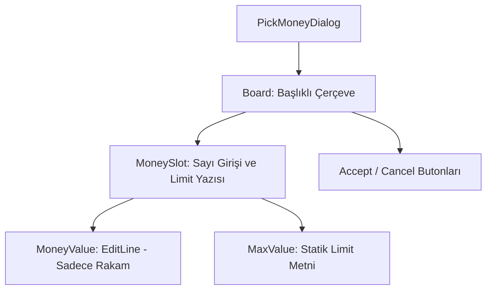

# 🎓 Metin2 Skills: `pickmoneydialog.py` (Miktar Seçimi - Ayırma)

`pickmoneydialog.py`, bir eşya yığınını (Örn: 200 adet Kırmızı İksir) bölmek veya belirli bir miktar Yang ayırmak için kullanılan sayı giriş penceresidir.

---

## 🔍 Neleri Yönetir?

### 1. Sayı Giriş Alanı (`money_value`)
Oyuncunun ayırmak istediği miktarı yazdığı alandır.
- **`only_number : 1`**: Sadece rakam girilmesine izin verir.
- **`input_limit : 6`**: Genellikle 999.999'a kadar olan eşya yığınları için yeterli bir sınırdır.

### 2. Maksimum Değer Göstergesi (`max_value`)
Giriş kutusunun yanında, yığında toplam kaç adet eşya olduğunu gösteren (`/ 999999` gibi) bilgilendirme yazısıdır.

### 3. Kontrol Butonları
Belirtilen miktarı ayırmak (`OK`) veya vazgeçmek (`CANCEL`) için kullanılır.

---

## 🛠️ Modifikasyon ve Kritik Uyarılar

### ✅ Otomatik Maksimum Sayı:
Oyuncu pencereyi açtığında genellikle kutu içinde `1` yazar. Eğer varsayılan olarak maksimum sayının yazılı gelmesini istiyorsan, bu değişiklik `root/uipickmoney.py` içindeki `Open` fonksiyonunda yapılmalıdır.

### ⚠️ Limit Senkronizasyonu:
Buraya yazılan sayı, `max_value` değerinden büyük olamaz. Bu kontrol `root` tarafında dinamik olarak yapılır.

---

## 📉 pickmoneydialog.py Tasarım Hiyerarşisi

---

**Veri Akışı:** `Envanter (Shift + Click)` -> `root/uipickmoney.py` -> `pickmoneydialog.py` -> Ekran.
