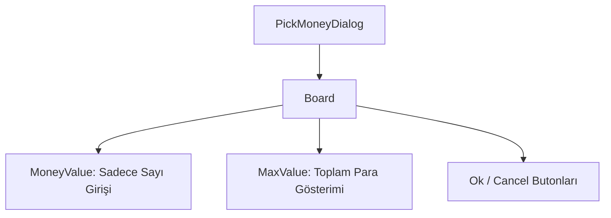

# 🎓 Metin2 Skills: `pickmoneydialog.py` (Yang/Para Ayırma Tasarımı)

`pickmoneydialog.py`, envanterdeki Yang (oyun parası) miktarına tıklandığında veya yere para atılmak istendiğinde açılan ve "Ne kadar ayırmak istiyorsun?" diye soran arayüzdür.

---

## 🔍 Neleri Yönetir?

### 1. Sadece Sayı Girişi (`only_number : 1`)
Oyuncunun harf veya özel karakter girmesini donanımsal olarak engeller. Sadece rakamlara izin verir.

### 2. Maksimum Miktar Önizlemesi (`max_value`)
Giriş kutusunun hemen yanında, oyuncunun envanterinde sahip olduğu toplam parayı referans olarak gösterir (Örn: `/ 999999`). Bu metin Python tarafında oyuncunun bakiyesine göre güncellenir.

---

## 🛠️ Modifikasyon ve Kritik Uyarılar

### ✅ Yang Sınırı (Limit):
Standart Metin2'de bu penceredeki `input_limit` genellikle 6 veya 9'dur (Maksimum 999.999.999 Yang). Eğer sunucun "Trilyonluk" (15 haneli) paraları destekliyorsa, bu sınırı kesinlikle artırmalısın, yoksa oyuncular paralarını transfer edemez.

## 📉 pickmoneydialog.py Yapısı

