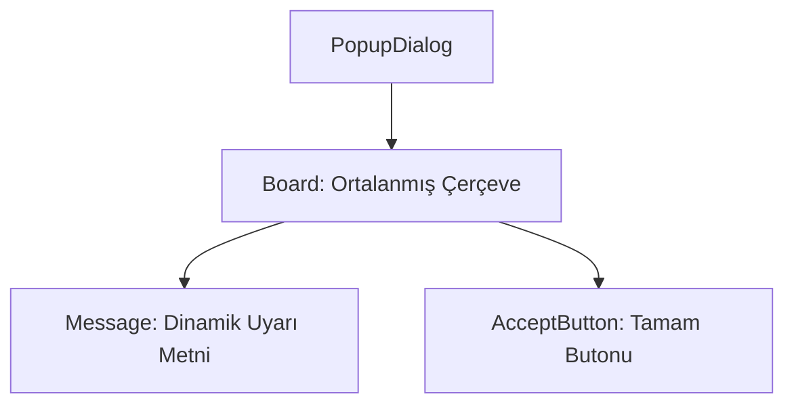

# 🎓 Metin2 Skills: `popupdialog.py` (Uyarı Mesajı Tasarımı)

`popupdialog.py`, oyunda hata mesajları, bilgilendirmeler veya sistem bildirimleri ("Envanterin dolu!", "Bu eşyayı kullanamazsın") için kullanılan, ortasında yazı ve altında tek bir "Tamam" butonu olan genel uyarı penceresidir.

---

## 🔍 Neleri Yönetir?

### 1. Dinamik Mesaj Metni (`message`)
Uyarı metnini barındırır. Metin her zaman yatay (`text_horizontal_align`) ve dikey (`text_vertical_align`) olarak tam ortalanır. Oyun kodları buradaki `message` nesnesine dışarıdan metin yazar.

### 2. Onay Butonu (`accept`)
Tek fonksiyonu pencereyi kapatmak veya bildirimi onaylamak olan "Tamam" (OK) butonunu içerir. Bu buton da pencerenin altına ortalanmıştır (`horizontal_align : center`).

### 3. Ekranın Ortalanması
`x` ve `y` koordinatlarında `SCREEN_WIDTH/2 - 250` gibi formüller kullanılarak bu küçük pencerenin her çözünürlükte ekranın tam merkezine oturması sağlanır.

---

## 🛠️ Modifikasyon ve Kritik Uyarılar

### ✅ Uzun Mesajlar:
Eğer sunucunda çok uzun uyarı metinleri yazdıracaksan, pencerenin `height` ve `width` değerlerini artırmalısın, aksi halde metin çerçevenin dışına taşar veya kesilir.

### ⚠️ questiondialog.py ile Farkı:
`questiondialog.py` oyuncuya bir seçenek sunarken (Evet/Hayır), `popupdialog.py` sadece bilgi verir (Tamam). Sadece okuyup geçilecek bilgiler için daima bu pencere kullanılır.

---

## 📉 popupdialog.py Yapısı

**Sonuç:** `popupdialog.py`, oyunun "Trafik İşareti"dir. Oyuncuyu bilgilendirmek ve kuralları hatırlatmak için kullanılır.
