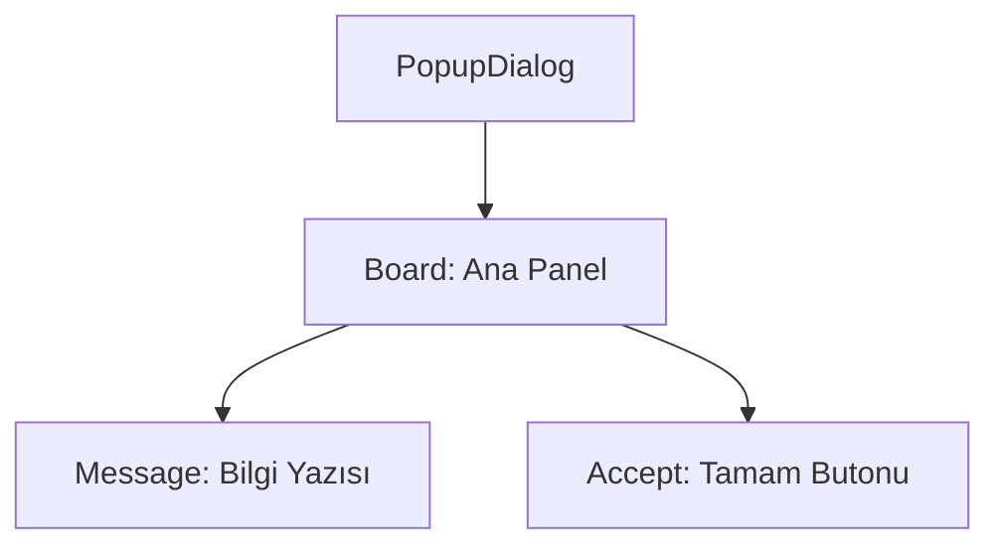

# 🎓 Metin2 Skills: `popupdialog.py` (Bilgi Pop-up Penceresi)

`popupdialog.py`, oyuncuya bir bilgi vermek (Örn: "Envanter dolu") veya bir hata göstermek için kullanılan, sadece tek bir "Tamam" butonu içeren penceredir.

---

## 🔍 Neleri Yönetir?

### 1. Bilgi Mesajı (`message`)
Ekranda gösterilecek uyarı veya bilgi yazısını barındırır.

### 2. Tek Buton (`accept`)
İşlemi onaylayıp pencereyi kapatan "Tamam" (`OK`) butonudur. `horizontal_align : center` ile pencerenin tam ortasına yerleştirilmiştir.

---

## 🛠️ Modifikasyon ve Kritik Uyarılar

### ✅ Otomatik Boyut:
Pencere boyutları genellikle sabittir (`280x105`). Eğer mesajlar çok uzunsa ve sığmıyorsa `width` değerini artırıp `message` kısmındaki `limit_width` (Kod tarafında) ayarlarını kontrol etmelisin.

---

## 📉 popupdialog.py Tasarım Hiyerarşisi

---

**Veri Akışı:** `root/uicommon.py` -> `popupdialog.py` -> Ekran.
