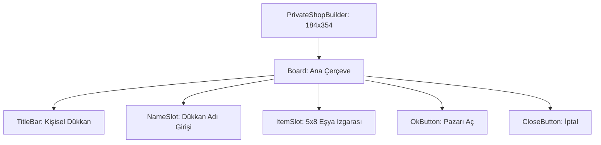

# 🎓 Metin2 Skills: `privateshopbuilder.py` (Pazar Kurma Tasarımı)

`privateshopbuilder.py`, oyuncuların kendi kişisel dükkanlarını (Pazar) kurarken açılan, eşyaları yerleştirip fiyat belirledikleri pencerenin tasarım dosyasıdır.

---

## 🔍 Neleri Yönetir?

### 1. Dükkan Adı Girişi (`NameSlot` / `NameLine`)
Pazarın başlığının yazılacağı metin kutusunu yönetir. Maksimum 25 karakter sınırı vardır (`input_limit: 25`).

### 2. Eşya Izgarası (`ItemSlot`)
Satışa konulacak eşyaların yerleştirildiği 5x8 (40 slot) boyutunda bir `grid_table` alanını belirler. NPC market ile aynı boyuttadır.

### 3. İşlem Butonları (`OkButton` / `CloseButton`)
Pazarı açmayı onaylayan veya işlemi iptal eden butonların konumlarını yönetir.

### 4. Boyut Hesaplaması
Pencerenin yüksekliği `328 + 26` olarak hesaplanmıştır. Ekstra 26 piksel, dükkan ismi giriş alanı için ayrılmıştır.

---

## 🛠️ Modifikasyon ve Kritik Uyarılar

### ✅ Slot Sayısını Artırma:
Daha fazla eşya satışa koymak istersen `y_count` değerini artırarak slot sayısını genişletebilirsin. Tabii `height` değerini de buna göre büyütmelisin.

### ✅ İsim Uzunluğu:
`input_limit` değerini artırarak daha uzun pazar isimleri yazmayı mümkün kılabilirsin. Ancak sunucu tarafının da bu uzunluğu desteklemesi gerekir.

### ⚠️ Slot Başlangıç İndeksi:
`start_index: 0` değeri, bu slotların envanterdeki slotlardan bağımsız olduğunu gösterir. Bunu değiştirmek eşyaların yanlış yerlere konulmasına neden olabilir.

---

## 📉 privateshopbuilder.py Yapısı

---

**Sonuç:** `privateshopbuilder.py`, oyuncuların "Esnaf" olmasını sağlayan arayüzdür. Oyun ekonomisinin temel taşlarından biridir.
