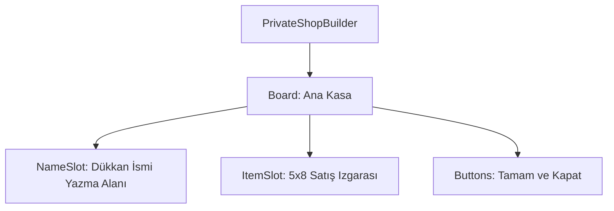

# 🎓 Metin2 Skills: `privateshopbuilder.py` (Pazar Kurma Penceresi)

`privateshopbuilder.py`, oyuncunun kendi pazarını kurarken dükkan ismini belirlediği ve satılacak eşyaları yerleştirdiği arayüzdür.

---

## 🔍 Neleri Yönetir?

### 1. Dükkan İsmi Girişi (`NameSlot`)
Oyuncunun pazarın üzerinde görünecek ismi yazdığı alandır.
- **`input_limit: 25`**: Pazar isminin maksimum 25 karakter olabileceğini belirler.
- **`NameLine`**: Yazılan metni tutan `text` (aslında kod tarafında `editline` olarak kullanılır) kontrolüdür.

### 2. Satış Izgarası (`ItemSlot`)
Envanterden sürüklenen eşyaların pazar masasına konulduğu 5x8 boyutundaki alandır.
- **`x_count: 5`, `y_count: 8`**: Toplam 40 slotluk bir dükkan kapasitesi sağlar.

### 3. Kurma ve İptal Butonları
- **`OkButton`**: Pazarı kurma işlemini onaylar ve dükkanı açar.
- **`CloseButton`**: İşlemi iptal eder.

---

## 🛠️ Modifikasyon ve Kritik Uyarılar

### ✅ Pazar Kapasitesini Artırma:
Daha büyük bir pazar (Örn: 80 slot) istiyorsan, `y_count` değerini artırıp pencerenin `height` değerini buna göre büyütmelisin. Ayrıca sunucu tarafında da dükkan paketinin bu kapasiteyi desteklemesi gerekir.

### ⚠️ Fiyat Belirleme:
Eşyalar bu masaya sürüklendiğinde, `root/uiprivateshopbuilder.py` tarafından bir fiyat giriş penceresi (`inputdialog`) tetiklenir. Eşyaların fiyatları bu pencerede saklanmaz, sadece görselleri saklanır.

---

## 📉 privateshopbuilder.py Tasarım Hiyerarşisi

---

**Veri Akışı:** `Oyuncu Girdisi` -> `root/uiprivateshopbuilder.py` -> `Server (Build Shop Packet)`.
