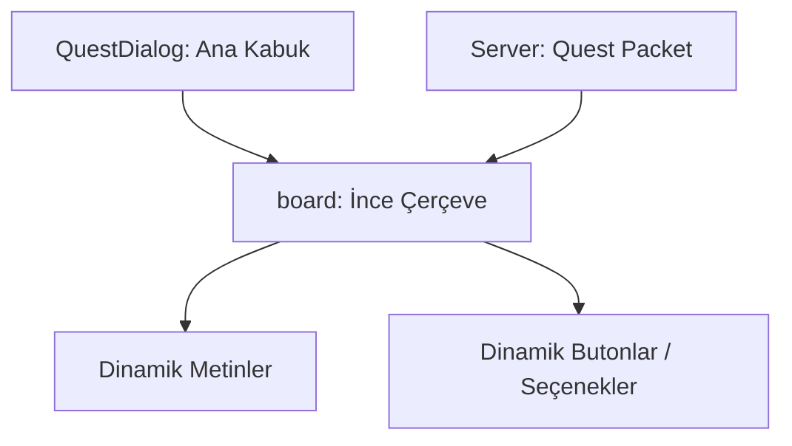

# 🎓 Metin2 Skills: `questdialog.py` (Görev Penceresi)

`questdialog.py`, oyundaki NPC'lerle konuştuğunuzda açılan o klasik kahverengi/parşömen görünümlü "Görev Seçenekleri" penceresinin temel iskeletidir.

---

## 🔍 Neleri Yönetir?

### 1. Panel Türü (`thinboard`)
Bu pencere, standart kalın çerçeveli paneller yerine daha zarif olan `thinboard` tipini kullanır. Bu sayede ekranın ortasında daha az yer kaplar ve parşömen havası verir.

### 2. Hizalama (`center`)
Pencere, ekran çözünürlüğünden bağımsız olarak her zaman ekranın tam ortasında (`horizontal_align: center`, `vertical_align: center`) açılacak şekilde yapılandırılmıştır.

### 3. Dinamik İçerik (Kod Tarafı)
Bu `.py` dosyasında butonlar veya yazılar görünmez. Bunun nedeni; görev penceresinin içeriğinin (Kaç seçenek var, hangi yazı yazıyor?) serverdan gelen verilere göre `root/uiquest.py` tarafından anlık olarak oluşturulmasıdır.

---

## 🛠️ Modifikasyon ve Kritik Uyarılar

### ✅ Boyut Ayarı:
Eğer görevlerdeki yazılar çok uzunsa ve sığmıyorsa, `board` içindeki `width` ve `height` değerlerini büyüterek pencereyi genişletebilirsin.

### ⚠️ Görsel Değişimi:
`thinboard` tipinin kullandığı görsel `ETC` içindeki `thinboard.sub` dosyasıdır. Bunu değiştirerek görev penceresinin rengini veya dokusunu değiştirebilirsin.

---

## 📉 questdialog.py Tasarım Hiyerarşisi

---

**Veri Akışı:** `Server (Quest Lua)` -> `uiquest.py` (Logic) -> `questdialog.py` (Layout) -> Ekran.
