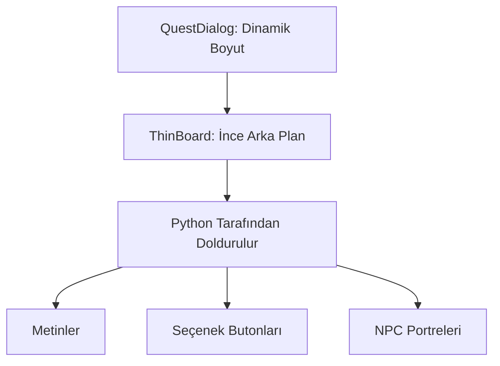

# 🎓 Metin2 Skills: `questdialog.py` (Görev Penceresi Tasarımı)

`questdialog.py`, oyuncu bir görev parşömenine veya NPC'ye tıkladığında açılan, hikaye metinlerinin okunduğu ve seçimlerin (Örn: "Evet kabul ediyorum", "Hayır teşekkürler") yapıldığı klasik görev ekranıdır.

---

## 🔍 Neleri Yönetir?

### 1. Boş Kanvas (`thinboard`)
Bu pencere, diğer tüm arayüzlerin aksine sadece bir arka plan (çerçeve) sunar. İçindeki butonlar, yazılar, resimler ve NPC portreleri, LUA (quest) dosyalarının gönderdiği komutlarla Python (`uiQuest.py`) tarafından anlık olarak çizilir.

### 2. Boyut İhmali (`ignore_size`)
Çerçeveye `ignore_size` stili atanmıştır. Bu, çerçevenin içindeki metin uzadıkça dinamik olarak kendi boyutunu aşağı doğru esnetebilmesi anlamına gelir.

---

## 🛠️ Modifikasyon ve Kritik Uyarılar

### ✅ Yeni Quest Arayüzleri:
Günümüz sunucularında görev pencereleri genelde şeffaf kahverengi arka planlar yerine daha modern ve resimli arka planlara (Örn: Eski püskü bir parşömen resmi) sahiptir. `thinboard` tipini `image` yapıp bir `.tga` bağlayarak görev penceresini görsel bir şölene çevirebilirsin.

## 📉 questdialog.py Yapısı

