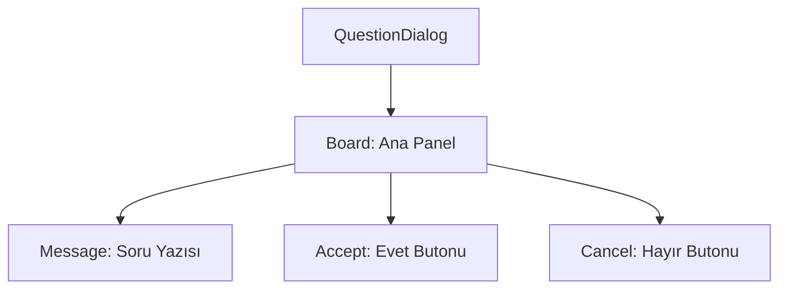

# 🎓 Metin2 Skills: `questiondialog.py` (Standart Onay Penceresi)

`questiondialog.py`, oyunda "Emin misiniz?" gibi basit evet/hayır soruları sormak için kullanılan en temel onay penceresidir.

---

## 🔍 Neleri Yönetir?

### 1. Tek Satır Mesaj (`message`)
Kullanıcıya sorulan soruyu (`uiScriptLocale.MESSAGE`) gösteren merkezlenmiş metin alanıdır.

### 2. Evet / Hayır Butonları (`accept`, `cancel`)
Standart `Middle_Button` görsellerini kullanan ve işlemin sonucunu `root` tarafına ileten butonlardır.

### 3. Ekran Konumu
Ekranın tam ortasında açılır. `width: 340` değeri, çoğu soru cümlesi için yeterli genişliği sağlar.

---

## 🛠️ Modifikasyon ve Kritik Uyarılar

### ✅ Buton Yerleşimi:
`x: -40` ve `x: 40` değerleri, butonların merkezden ne kadar uzakta duracağını belirler. Eğer daha büyük butonlar kullanacaksan bu aralığı açmalısın.

### ⚠️ Kod Bağlantısı:
Bu pencere `root/uicommon.py` içindeki `QuestionDialog` sınıfı tarafından dinamik olarak yönetilir.

---

## 📉 questiondialog.py Tasarım Hiyerarşisi

---

**Veri Akışı:** `root/uicommon.py` -> `questiondialog.py` -> Ekran.
