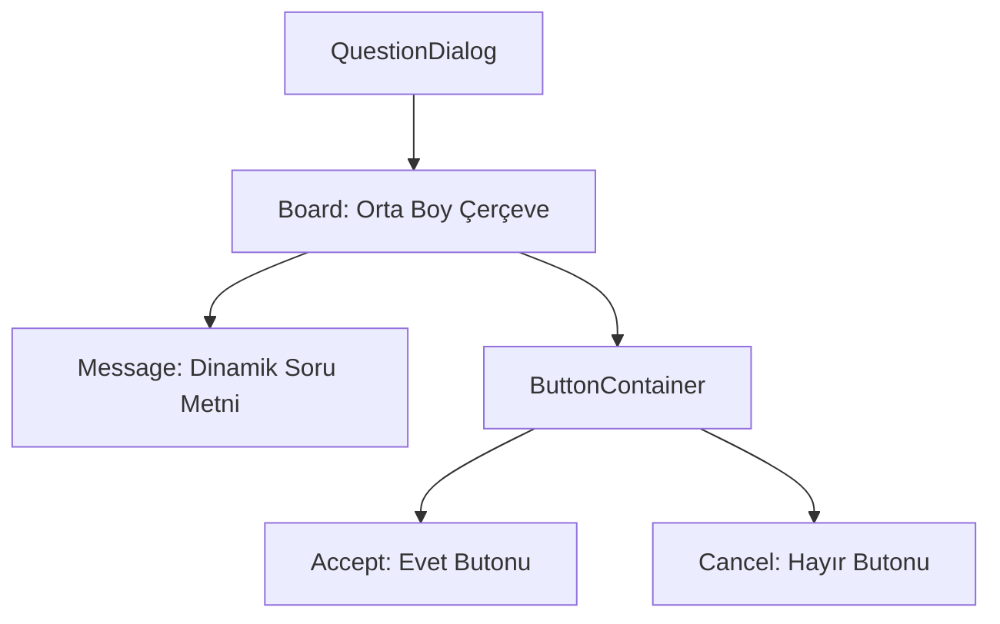

# 🎓 Metin2 Skills: `questiondialog.py` (Onay Penceresi Tasarımı)

`questiondialog.py`, oyunda çıkan "Emin misiniz?", "Silmek istiyor musunuz?" gibi Evet/Hayır sorularının sorulduğu genel onay penceresinin tasarım dosyasıdır.

---

## 🔍 Neleri Yönetir?

### 1. Mesaj Alanı (`message`)
Sorulan sorunun pencerenin neresinde duracağını belirler. 
- **`horizontal_align`**: Sorunun her zaman pencereyi ortalamasını sağlar.
- **`y : 38`**: Yazının dikey konumudur.

### 2. Onay ve İptal Butonları (`accept` & `cancel`)
"Evet" ve "Hayır" butonlarının konumlarını yönetir.
- **`x : -40` / `x : 40`**: Butonları pencerenin ortasından sağa ve sola simetrik olarak dağıtır.

### 3. Ana Çerçeve (`board`)
Pencerenin toplam genişlik (340) ve yüksekliğini (105) belirler. Bu pencere oyunun en sık kullanılan "Pop-up" ekranıdır.

---

## 🛠️ Modifikasyon ve Kritik Uyarılar

### ✅ Görsel Modernizasyon:
Sıkıcı gri renklerden kurtulmak için `board` ve `button` görsellerini sunucunun özel temasıyla (Örn: Altın sarısı çerçeveler) değiştirebilirsin.

### ✅ Uzun Cümleler İçin Genişletme:
Eğer soracağın sorular çok uzunsa (Örn: 3 satırlık bir uyarı), `height` değerini artırıp `message` koordinatlarını yukarı çekmelisin.

### ⚠️ Buton İsimleri:
`accept` ve `cancel` isimleri Python tarafındaki `uiCommon.py` ile bağlantılıdır. Bu isimleri değiştirirsen butonlar tıklansa bile işlem yapmaz.

---

## 🚨 Hata Ayıklama (Debug)

**"Pencere açılıyor ama yazı görünmüyor" sorunu:**
1.  `message` içindeki `text` değerinin boş olup olmadığını kontrol et. (Gerçek yazı Python tarafından basılır, ama burada bir varsayılan değer olmalıdır).
2.  Yazı renginin arka planla aynı olup olmadığını kontrol et.

---

## 📉 questiondialog.py Tasarım Şeması

---

**Sonuç:** `questiondialog.py`, oyunun "Güvenlik Süzgecidir". Kritik kararlardan önce oyuncuya son bir kez sorulan soruların sunumunu yapar.
