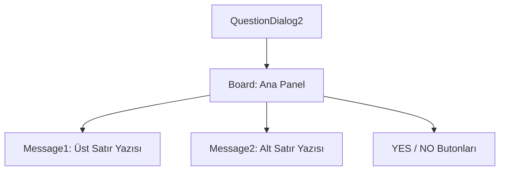

# 🎓 Metin2 Skills: `questiondialog2.py` (Çift Satırlı Onay Penceresi)

`questiondialog2.py`, oyuncuya bir soru sormak için kullanılan ancak `questiondialog`'dan farklı olarak **iki satır metin** desteği sunan onay penceresidir.

---

## 🔍 Neleri Yönetir?

### 1. Çift Satır Metin (`message1`, `message2`)
Pencere içinde alt alta duran iki ayrı metin alanı barındırır. Bu, özellikle açıklamanın uzun olduğu veya "A eşyası B eşyasına dönüşecek, onaylıyor musun?" gibi iki aşamalı bilgiler için idealdir.

### 2. Standart Onay Butonları (`YES`, `NO`)
Kullanıcının seçimine göre `accept` veya `cancel` sinyallerini gönderen butonlardır.

### 3. Merkezi Konumlandırma
Pencere her zaman ekranın tam ortasında (`SCREEN_WIDTH/2 - 125`) açılacak şekilde formüle edilmiştir.

---

## 🛠️ Modifikasyon ve Kritik Uyarılar

### ✅ Metin Aralığı:
`y: 25` ve `y: 50` değerleri iki satır arasındaki dikey boşluğu belirler. Eğer yazılar birbirine çok yakın gelirse bu değerleri esnetebilirsin.

### ⚠️ Generic Yapı:
Bu dosya da bir şablondur. `root/uicommon.py` içindeki `QuestionDialog2` sınıfı tarafından çağrılarak anlık olarak doldurulur.

---

## 📉 questiondialog2.py Tasarım Hiyerarşisi

---

**Veri Akışı:** `root/uicommon.py` -> `questiondialog2.py` -> Ekran.
