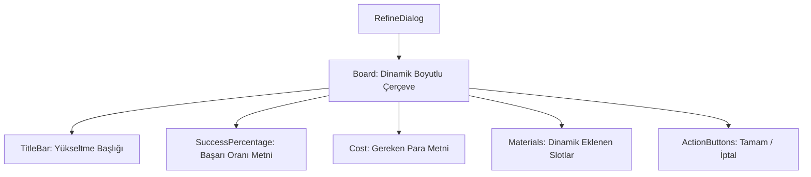

# 🎓 Metin2 Skills: `refinedialog.py` (Eşya Yükseltme Tasarımı)

`refinedialog.py`, Demirci veya Nesne Yükseltme kağıtları kullanıldığında açılan, gerekli malzemelerin ve başarı şansının gösterildiği "Yükseltme" (Plus basma) penceresinin tasarım dosyasıdır.

---

## 🔍 Neleri Yönetir?

### 1. Başarı Şansı (`SuccessPercentage`)
Eşyanın bir sonraki seviyeye geçme ihtimalini (Örn: %80) gösteren metin alanının konumunu yönetir.

### 2. Yükseltme Maliyeti (`Cost`)
İşlem için gereken Yang miktarını gösteren metin alanını belirler.

### 3. Kabul ve İptal Butonları (`Accept` & `Cancel`)
Yükseltme işlemini başlatan veya pencereyi kapatan butonların yerleşimini yönetir.

### 4. Dinamik Boyutlandırma (`width: 0`, `height: 0`)
Bu pencerenin boyutu sabit değildir. `uiRefine.py` dosyası, yükseltme için kaç adet malzeme (1-5 arası) gerektiğini hesaplar ve pencereyi ona göre otomatik olarak büyütür/küçültür.

---

## 🛠️ Modifikasyon ve Kritik Uyarılar

### ✅ Şans Yazısını Vurgulama:
Başarı şansının daha dikkat çekici olması için bu dosyadaki `y` koordinatlarını değiştirebilir veya `uiRefine.py` üzerinden bu metnin rengini dinamik hale getirebilirsin.

### ✅ Malzeme Slotlarının Yerleşimi:
Malzemelerin dizileceği slotlar bu dosyada görünmez; çünkü onlar Python kodu tarafından çalışma anında (runtime) oluşturulur. Ancak ana çerçevenin (`Board`) stili buradan değiştirilebilir.

### ⚠️ Başlık Rengi (`color: "red"`):
Başlık çubuğunun rengini değiştirerek yükseltme penceresine daha agresif veya daha sakin bir görünüm verebilirsin.

---

## 🚨 Hata Ayıklama (Debug)

**"Yükseltme penceresi çok küçük açılıyor, malzemeler görünmüyor" sorunu:**
1.  Bu genellikle bu `.py` dosyasından değil, `uiRefine.py` içindeki boyut hesaplama formülünden kaynaklanır. Ancak `Board` genişliğinin `titlebar` genişliğinden küçük olmadığından emin olmalısın.

---

## 📉 refinedialog.py Katman Şeması

---

**Sonuç:** `refinedialog.py`, oyunun "Risk ve Ödül" ekranıdır. Oyuncuların en heyecanlı (veya üzüntülü) anlarını yaşadıkları bu ekranın netliği çok önemlidir.
