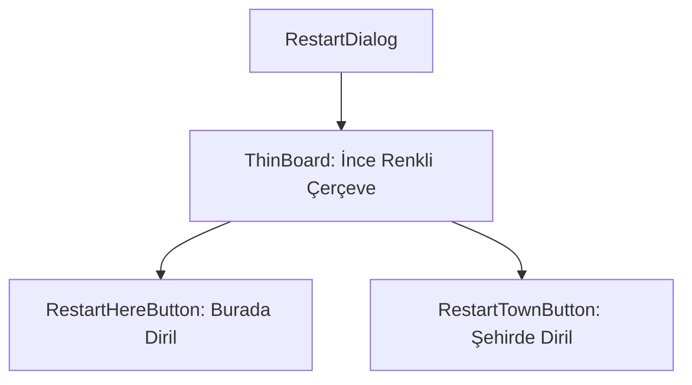

# 🎓 Metin2 Skills: `restartdialog.py` (Ölüm/Dirilme Ekranı Tasarımı)

`restartdialog.py`, karakterin HP'si sıfırlandığında (öldüğünde) ekranda beliren ve oyuncuya nerede dirileceğini soran pencerenin tasarım dosyasıdır.

---

## 🔍 Neleri Yönetir?

### 1. Dirilme Seçenekleri
- **`restart_here_button`**: "Burada Diril" butonu. Belirli bir süre bekledikten sonra (veya tecrübe puanı kaybederek) aynı koordinatta canlanmayı sağlar.
- **`restart_town_button`**: "Şehirde Diril" butonu. Karakteri bulunduğu haritanın başlangıç noktasına (köye) ışınlayarak diriltir.

### 2. İnce Çerçeve Yapısı
Normal pencerelerden farklı olarak `thinboard` (ince çerçeve) kullanılır ve RGB renk kodlarıyla (`r: 0.3333`, `g: 0.2941` vb.) hafif kahverengimsi/şeffaf bir arka plan rengi atanmıştır.

---

## 🛠️ Modifikasyon ve Kritik Uyarılar

### ✅ Özel Butonlar Eklemek:
Bazı sunucularda "Otomatik Diril" veya "Özel Eşya ile Diril" gibi seçenekler bulunur. Yeni bir buton eklemek için `y` koordinatını artırarak (Örn: `y : 77`) üçüncü bir buton ekleyebilir ve pencere yüksekliğini (`height`) buna göre genişletebilirsin.

### ⚠️ Buton İşlevleri:
Bu dosya sadece butonların ekrandaki konumunu ayarlar. Butonlara tıklandığında sürenin sayması veya karakterin canlanması gibi mantıksal işlemler `uiRestart.py` dosyasında işlenir.

---

## 📉 restartdialog.py Yapısı

**Sonuç:** `restartdialog.py`, oyuncunun başarısızlık sonrasında yeniden ayağa kalktığı "İkinci Şans" ekranıdır. Basit, net ve hızlı erişilebilir olmalıdır.
