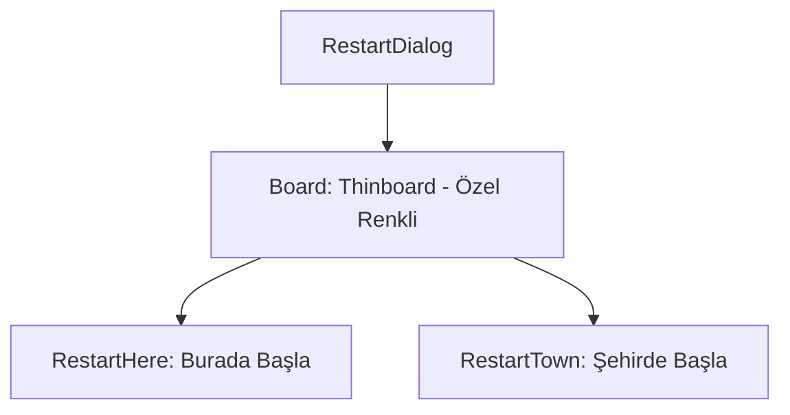

# 🎓 Metin2 Skills: `restartdialog.py` (Yeniden Başlama Penceresi)

`restartdialog.py`, karakteriniz öldüğünde ekranda beliren ve nerede yeniden canlanacağınızı seçmenizi sağlayan (Burada Yeniden Başla / Şehirde Yeniden Başla) penceredir.

---

## 🔍 Neleri Yönetir?

### 1. Canlanma Seçenekleri
İki ana butonu barındırır:
- **`restart_here_button`**: Karakterin öldüğü noktada (Eğer varsa Ejderha Kutsaması vb. kullanarak) canlanmasını sağlar.
- **`restart_town_button`**: Karakterin o haritanın başlangıç noktasına (Şehir) ışınlanarak canlanmasını sağlar.

### 2. Panel Rengi (`r, g, b, a`)
`thinboard` tipindeki bu panelde özel bir renk tanımı (`0.33, 0.29, 0.25`) kullanılmıştır. Bu, panelin hafif kahverengi/parşömen tonlarında görünmesini sağlar.

---

## 🛠️ Modifikasyon ve Kritik Uyarılar

### ✅ Buton Bekleme Süresi:
"Burada Yeniden Başla" butonu genellikle öldükten 10 saniye sonra aktif olur. Bu süre görsel bir efektle (Geri sayım) buton üzerinde gösterilir. Bu mantık `root/uirestart.py` içinden yönetilir.

---

## 📉 restartdialog.py Tasarım Hiyerarşisi

---

**Veri Akışı:** `root/uirestart.py` -> `restartdialog.py` -> `Server (Restart Packet)`.
