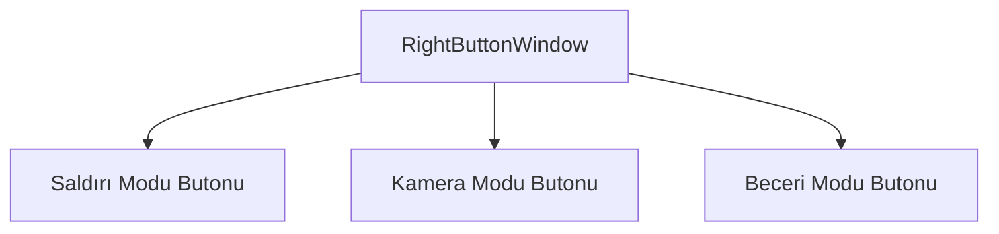

# 🎓 Metin2 Skills: `rightmousebuttonwindow.py` (Sağ Tık Fonksiyon Seçimi)

`rightmousebuttonwindow.py`, oyun görev çubuğunun (Taskbar) sağ alt köşesinde bulunan ve sağ fare tuşunun ne işe yarayacağını (Saldır/Hareket, Sadece Kamera, Beceri Kullanımı) değiştirmeyi sağlayan küçük menünün tasarımıdır.

---

## 🔍 Neleri Yönetir?

### 1. Fare Modu Butonları
Aşağıdaki üç modu seçmek için küçük butonlar sunar:
- **`button_move_and_attack`**: Sağ tık hem karakteri yürütür hem de saldırı yapar.
- **`button_camera`**: Sağ tık sadece kamerayı döndürür.
- **`button_skill`**: Sağ tık, hızlı slota konmuş bir beceriyi ateşler.

### 2. İpuçları (Tooltips)
Her butonun üzerinde fareyle beklendiğinde çıkacak olan bilgi notlarının koordinatlarını (`tooltip_x`, `tooltip_y`) belirler.

---

## 🛠️ Modifikasyon ve Kritik Uyarılar

### ⚠️ Görsel Bütünlük:
Bu menü, tıklandığında görev çubuğundan yukarıya doğru açılır. Koordinatları veya boyutlarını değiştirirseniz, görev çubuğuyla arasına boşluk girebilir ve UI estetiği bozulabilir.

## 📉 rightmousebuttonwindow.py Yapısı

