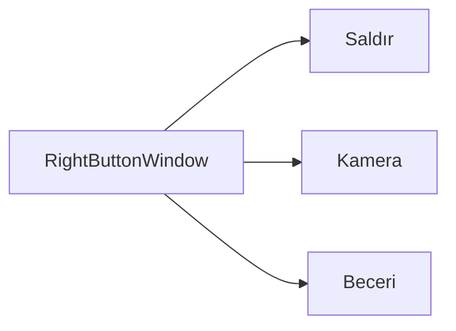

# 🎓 Metin2 Skills: `rightmousebuttonwindow.py` (Sağ Tık Fonksiyon Paneli)

`rightmousebuttonwindow.py`, farenin sağ tıklandığında ne yapacağını belirleyen (Saldır, Kamera, Beceri Kullan) küçük yatay butun panelidir.

---

## 🔍 Neleri Yönetir?

### 1. Sağ Tık Modları
Panelde üç seçenek bulunur:
- **`button_move_and_attack`**: Sağ tıkla saldırma modu.
- **`button_camera`**: Sağ tıkla kamera kontrolü.
- **`button_skill`**: Sağ tıka atanan yeteneği (Skill) kullanma modu.

### 2. Yatay Dizilim
Sol tık panelinden farklı olarak, bu panel yatay (`x: 0, 32, 64`) bir dizilim kullanır.

---

## 🛠️ Modifikasyon ve Kritik Uyarılar

### ✅ Beceri Kısayolu:
Metin2'de en çok kullanılan mod `button_skill` modudur. Eğer oyuncu sağ tıka bastığında hiçbir şey olmuyorsa, bu panel üzerinden beceri modunun seçili olup olmadığı kontrol edilmelidir.

---

## 📉 rightmousebuttonwindow.py Tasarım Hiyerarşisi

---

**Veri Akışı:** `root/uitaskbar.py` -> `rightmousebuttonwindow.py`.
