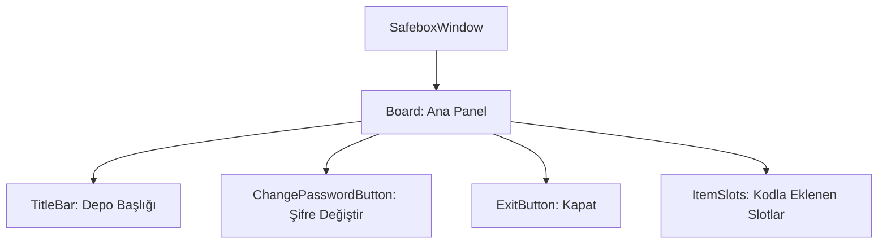

# 🎓 Metin2 Skills: `safeboxwindow.py` (Depo Tasarımı)

`safeboxwindow.py`, oyuncuların eşyalarını sakladığı "Depo" ve "Nesne Market Deposu" arayüzlerinin temel görsel yapısını belirleyen tasarım dosyasıdır.

---

## 🔍 Neleri Yönetir?

### 1. Ana Pencere Yapısı (`SafeboxWindow`)
Deponun ekran üzerindeki varsayılan konumunu ve 176x250 piksellik standart boyutlarını yönetir.

### 2. Şifre Değiştirme Butonu (`ChangePasswordButton`)
Depo güvenliği için kullanılan "Şifre Değiştir" penceresini açan butonun yerleşimini ve görselini belirler.

### 3. Kapat Butonu (`ExitButton`)
Depo ile etkileşimi sonlandıran ve pencereyi kapatan alt butonun koordinatlarını yönetir.

### 4. Başlık Çubuğu (`TitleBar`)
Deponun en üstünde bulunan ve "Depo" yazan sarı renkli başlık alanını yönetir.

---

## 🛠️ Modifikasyon ve Kritik Uyarılar

### ✅ Depo Sayfalarını Artırma:
Eğer sunucun birden fazla depo sayfasını destekliyorsa, bu dosyaya yeni "Sayfa 1", "Sayfa 2" gibi `radio_button` bileşenleri ekleyerek sayfalar arası geçişi kolaylaştırabilirsin.

### ✅ Boyut Düzenleme:
Depo slotları genellikle `uiSafebox.py` tarafından kodla eklenir. Ancak bu dosyadaki `height` değerini artırarak daha büyük ve ferah bir depo ekranı oluşturabilirsin.

### ⚠️ Buton Senkronizasyonu:
`ChangePasswordButton` ismini değiştirirsen, `uiSafebox.py` dosyası bu butonu bulamaz ve şifre değiştirme işlevi bozulur.

---

## 🚨 Hata Ayıklama (Debug)

**"Depoyu açtığımda sadece başlık görünüyor, butonlar yok" sorunu:**
1.  `board` içindeki `children` listesinde parantezlerin doğru kapandığından emin ol.
2.  Butonların `y` koordinatlarını kontrol et; `vertical_align : bottom` kullanıldığı için `y` değeri pencerenin altından yukarı doğru sayılır.

---

## 📉 safeboxwindow.py Yapısı

---

**Sonuç:** `safeboxwindow.py`, oyuncunun "Bankasıdır". Güvenli ve anlaşılır bir depo tasarımı, eşya yönetimini kolaylaştırır.
