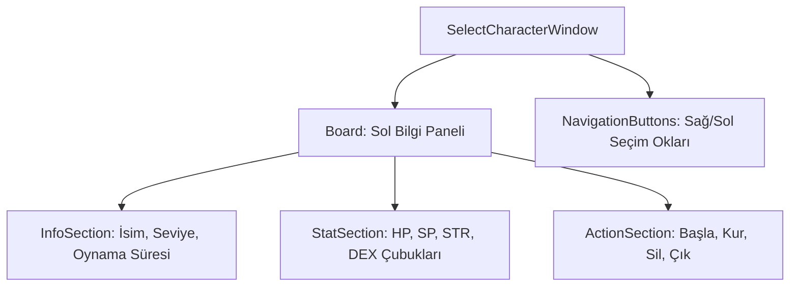

# 🎓 Metin2 Skills: `selectcharacterwindow.py` (Karakter Seçme Ekranı)

`selectcharacterwindow.py`, oyuncunun giriş yaptıktan sonra hangi karakteriyle oyuna başlayacağını seçtiği, karakterlerinin istatistiklerini ve görünümlerini incelediği ekrandır.

---

## 🔍 Neleri Yönetir?

### 1. Karakter İstatistikleri (`Gauge`)
Seçili karakterin temel güç değerlerini renkli çubuklarla (`gauge`) gösterir:
- **`character_hth`**: HP (Kırmızı).
- **`character_int`**: SP (Pembe).
- **`character_str`**: Saldırı Gücü (Mor).
- **`character_dex`**: Savunma/Çeviklik (Mavi).

### 2. İmparatorluk ve Lonca Bilgisi
Karakterin hangi krallığa ait olduğunu (`EmpireFlag`) ve varsa lonca ismini (`GuildName`) barındıran alanlardır.

### 3. Kontrol Butonları
- **`start_button`**: Oyuna girişi sağlar.
- **`create_button`**: Boş bir slot seçiliyse yeni karakter oluşturma ekranına yönlendirir.
- **`delete_button`**: Seçili karakteri silme işlemini tetikler.
- **`left / right_button`**: 3D karakter modelleri arasında geçiş yapmayı (Karakterleri döndürmeyi veya seçmeyi) sağlar.

---

## 🛠️ Modifikasyon ve Kritik Uyarılar

### ✅ Arayüz Tasarımı:
Bu ekran genellikle tam ekran (`width: SCREEN_WIDTH`) olarak tasarlanır. Arka plandaki 3D harita (Örn: `Select.msm`) `root/introselect.py` içinden yüklenir. Buradaki `.py` dosyası sadece üzerindeki 2D panelleri yönetir.

### ⚠️ Koordinat Dinamiği:
Butonların ve metinlerin konumları `BOARD_ITEM_ADD_POSITION` gibi değişkenlerle ekran çözünürlüğüne göre dinamik olarak kaydırılabilir.

---

## 📉 selectcharacterwindow.py Tasarım Hiyerarşisi

---

**Veri Akışı:** `Server (Character List)` -> `root/introselect.py` -> `selectcharacterwindow.py` -> Ekran.
