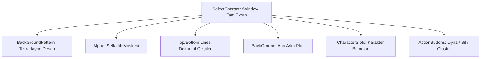

# 🎓 Metin2 Skills: `selectcharacterwindow.py` (Karakter Seçim Ekranı Tasarımı)

`selectcharacterwindow.py`, giriş yaptıktan sonra gelen ve hesaptaki mevcut karakterlerden birini seçtiğin, sildiğin veya yeni karakter oluşturduğun tam ekran arayüzünün tasarım dosyasıdır.

---

## 🔍 Neleri Yönetir?

### 1. Tam Ekran Ölçekleme (`expanded_image`)
Tüm arka plan öğeleri `SCREEN_WIDTH` ve `SCREEN_HEIGHT` değerlerini kullanarak her çözünürlükte (800x600, 1024x768, 1920x1080) ekranı tam kaplayacak şekilde gerilir.

### 2. Arka Plan Katmanları
Birden fazla arka plan katmanı üst üste kullanılır:
- **`BackGroundPattern`**: Tekrarlanan desen.
- **`Alpha`**: Şeffaflık gradyanı (üst ve alt kenarları karartır).
- **`Top_Line` / `Bottom_Line`**: Üst ve alt dekoratif çizgiler.

### 3. Karakter Slotları
Hesaptaki her karakter için bir slot butonu sunar. Tıklandığında 3D karakter modeli sahneye yüklenir.

### 4. İşlem Butonları
Seçilen karakter ile yapılacak eylemlerin (Oyna, Sil, Yeni Oluştur) tasarımını içerir.

---

## 🛠️ Modifikasyon ve Kritik Uyarılar

### ✅ Arka Plan Değiştirme:
Karakter seçim ekranına sunucunuza özel bir arka plan koymak istersen `BackGround` içindeki `image` yolunu değiştirmen yeterlidir.

### ✅ Ölçek Formülleri:
`float(SCREEN_WIDTH) / 800.0` gibi formüller, 800 piksel genişliğindeki orijinal görseli ekrana göre esnetiyor. Farklı boyutlu arka plan kullandığında bu böleni güncellemelisin.

### ⚠️ Konum Hesaplamaları:
`BOARD_X = SCREEN_WIDTH * (65) / 800` gibi formüller, panelin her çözünürlükte aynı oransal konumda kalmasını sağlar. Sabit piksel değerleri kullanırsan düşük çözünürlüklerde taşma olabilir.

---

## 📉 selectcharacterwindow.py Katman Yapısı

---

**Sonuç:** `selectcharacterwindow.py`, oyuna ilk adımda gördüğün "Vitrindir". Karakterlerinin şık bir şekilde sunulmasını sağlar.
