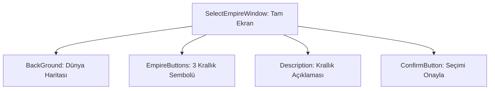

# 🎓 Metin2 Skills: `selectempirewindow.py` (Krallık Seçim Tasarımı)

`selectempirewindow.py`, yeni karakter oluşturulurken gelen krallık (İmparatorluk) seçim ekranının tasarım dosyasıdır. Shinsoo, Chunjo ve Jinno arasında seçim yapılır.

---

## 🔍 Neleri Yönetir?

### 1. Krallık Butonları
Üç krallığı temsil eden büyük sembol butonlarının konumlarını ve görsellerini belirler.

### 2. Krallık Açıklamaları
Her krallığın özelliklerini anlatan metin alanlarının yerleşimini yönetir. Hangi krallık seçiliyse o krallığın açıklaması görünür.

### 3. Harita Görseli
Arka planda dünya haritasının gösterilmesi ve seçilen krallığın harita üzerinde vurgulanmasını sağlar.

### 4. Tam Ekran Arka Plan
Diğer intro ekranları gibi `expanded_image` ile her çözünürlükte tam kaplama sağlar.

---

## 🛠️ Modifikasyon ve Kritik Uyarılar

### ✅ Krallık Açıklamalarını Değiştirme:
Açıklama metinleri `uiScriptLocale` üzerinden çekilir. Farklı dil dosyalarını düzenleyerek krallık tanıtımlarını özelleştirebilirsin.

### ⚠️ Krallık Sayısı:
3 krallık yapısı oyun motorunun derinliklerine işlenmiştir. 4. krallık eklemek sadece bu dosyayı değil, sunucu ve motor kodlarını da değiştirmeyi gerektirir.

---

## 📉 selectempirewindow.py Yapısı

---

**Sonuç:** `selectempirewindow.py`, oyuncunun "Vatandaşlık Belgesi"dir. Bu seçim karakterin tüm oyun boyunca ait olacağı tarafı belirler.
