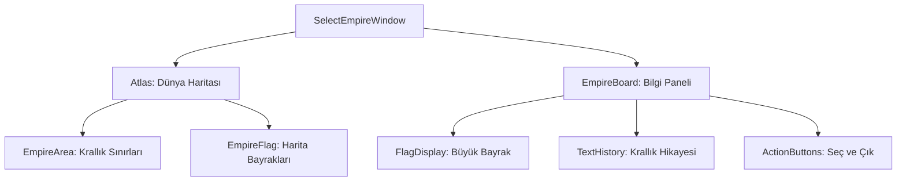

# 🎓 Metin2 Skills: `selectempirewindow.py` (Krallık Seçme Ekranı)

`selectempirewindow.py`, yeni bir hesapla oyuna başlandığında oyuncunun hangi krallığa (Shinsoo, Chunjo, Jinno) katılacağını seçtiği, krallıkların haritadaki yerlerini ve bayraklarını gördüğü ekrandır.

---

## 🔍 Neleri Yönetir?

### 1. Dünya Haritası ve Alanlar (`Atlas`)
Dünya haritasını (`atlas.sub`) ve krallıkların bu harita üzerindeki coğrafi sınırlarını (`EmpireArea_A, B, C`) barındırır.
- **`EmpireAreaFlag`**: Harita üzerinde krallıkların başkentlerini işaretleyen küçük bayrak ikonlarıdır.

### 2. Bilgi Paneli (`empire_board`)
Seçili krallık hakkında detaylı bilgi sunan yan paneldir:
- **`EmpireFlag`**: Seçilen krallığın büyük bayrak görselini gösterir.
- **`text_board`**: Krallığın tarihçesi ve özelliklerini anlatan metin alanıdır. `prev_text_button` ve `next_text_button` ile metin sayfaları arasında gezilebilir.

### 3. Kontrol Butonları
- **`select_button`**: Krallık seçimini onaylar ve karakter oluşturma ekranına geçer.
- **`exit_button`**: Giriş ekranına geri döner.

---

## 🛠️ Modifikasyon ve Kritik Uyarılar

### ✅ Krallık İsimlerini/Resimlerini Değiştirme:
Eğer krallıkların isimlerini veya bayraklarını değiştirmek istiyorsan, `LOCALE_PATH` içindeki `.sub` dosyalarını ve buradaki görsel yollarını güncelleyebilirsin.

### ⚠️ `rect` ve Ölçeklendirme:
`BackGround` ve `Alpha` katmanları `rect` parametresi kullanarak deseni tüm ekrana yayar. Ekran çözünürlüğü değişse bile desenin bozulmadan tekrarlanmasını sağlar.

---

## 📉 selectempirewindow.py Tasarım Hiyerarşisi

---

**Veri Akışı:** `İstemci Ayarları` -> `root/introempire.py` -> `selectempirewindow.py` -> Ekran.
